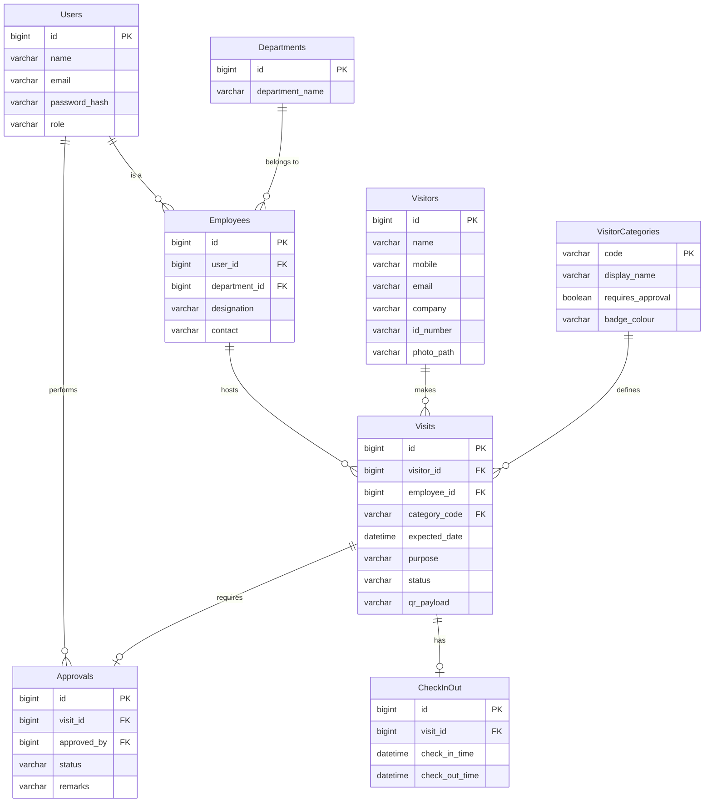

# Database Design, ER Diagram & Data Dictionary

## 1. ER Diagram
The following Mermaid diagram outlines the entity relationships for the VMS database.

## 2. Data Dictionary

### Table: Users
Stores authentication and profile details for Employees, Receptionists, Admins, and Security.
- `id` (BIGINT, PK): Unique identifier.
- `name` (VARCHAR): Full name.
- `email` (VARCHAR): Unique email, used for login.
- `password_hash` (VARCHAR): BCrypt hashed password.
- `role` (VARCHAR): Enum (ADMIN, RECEPTION, EMPLOYEE, SECURITY).

### Table: Employees
Extended profile for host employees.
- `id` (BIGINT, PK): Unique identifier.
- `user_id` (BIGINT, FK): Maps to Users.
- `department_id` (BIGINT, FK): Maps to Departments.
- `designation` (VARCHAR): Job title.
- `contact` (VARCHAR): Mobile/WhatsApp number for notifications.

### Table: Visitors
Master list of all visitors.
- `id` (BIGINT, PK): Unique identifier.
- `name` (VARCHAR): Full name.
- `mobile` (VARCHAR): E.164 formatted mobile number.
- `email` (VARCHAR): Contact email.
- `company` (VARCHAR): Affiliated company/organization.
- `id_number` (VARCHAR): Government ID number (masked in UI).
- `photo_path` (VARCHAR): File path to uploaded photo.

### Table: Visits
Transaction records for every visit instance.
- `id` (BIGINT, PK): Unique identifier.
- `visitor_id` (BIGINT, FK): Maps to Visitors.
- `employee_id` (BIGINT, FK): Maps to host Employee.
- `category_code` (VARCHAR, FK): Maps to VisitorCategories.
- `expected_date` (DATETIME): Scheduled date and time.
- `purpose` (VARCHAR): Reason for visit.
- `status` (VARCHAR): PENDING, APPROVED, REJECTED, CHECKED_IN, COMPLETED.
- `qr_payload` (TEXT): Cryptographically signed QR string.

### Table: Approvals
Logs of approval decisions.
- `id` (BIGINT, PK): Unique identifier.
- `visit_id` (BIGINT, FK): Maps to Visits.
- `approved_by` (BIGINT, FK): Maps to Users (Employee).
- `status` (VARCHAR): APPROVE/REJECT.
- `remarks` (VARCHAR): Optional reason for rejection.

### Table: CheckInOut
Tracks exact physical entry and exit.
- `id` (BIGINT, PK): Unique identifier.
- `visit_id` (BIGINT, FK): Maps to Visits.
- `check_in_time` (DATETIME): Timestamp of entry scan.
- `check_out_time` (DATETIME): Timestamp of exit scan.
