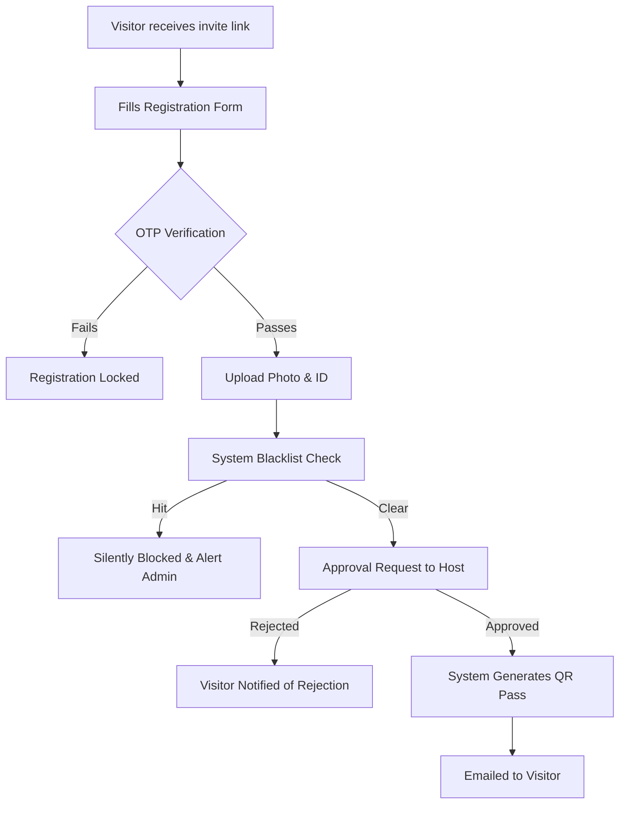
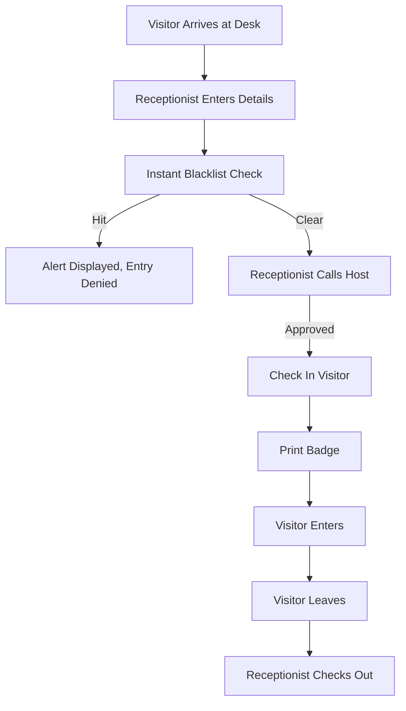

# Use Case Diagram & User Flows

## 1. Use Case Diagram
The following Mermaid diagram illustrates the primary interactions between the actors and the VMS.

```mermaid
usecaseDiagram
    actor Visitor
    actor Receptionist
    actor Employee
    actor Admin
    actor Security

    package "Visitor Management System" {
        usecase "Register Details" as UC1
        usecase "Verify OTP" as UC2
        usecase "Upload ID/Photo" as UC3
        usecase "Approve/Reject Visit" as UC4
        usecase "Generate QR Pass" as UC5
        usecase "Check-In / Check-Out" as UC6
        usecase "Scan QR Code" as UC7
        usecase "Manage Blacklist" as UC8
        usecase "View Real-time Dashboard" as UC9
        usecase "Generate Reports" as UC10
    }

    Visitor --> UC1
    Visitor --> UC2
    Visitor --> UC3

    Employee --> UC4

    Receptionist --> UC6
    
    Security --> UC7

    Admin --> UC8
    Admin --> UC9
    Admin --> UC10

    UC4 ..> UC5 : <<include>>
    UC1 ..> UC8 : <<include>>
```

## 2. User Flow: Pre-Registration


## 3. User Flow: Reception Walk-In

