# VMS — Architecture & Complete Workflow Guide
**A plain-language walkthrough of how the Visitor Management System works, from the moment a visitor clicks a link to the moment they leave the building.**

This document is written so that anyone — technical or non-technical — can understand what happens at every step. Each diagram is followed by a description in everyday language.

---

## Table of Contents

1. [The Big Picture — What VMS Actually Is](#1-the-big-picture--what-vms-actually-is)
2. [System Architecture — The Building Blocks](#2-system-architecture--the-building-blocks)
3. [Master Flow — Every Path a Visit Can Take](#3-master-flow--every-path-a-visit-can-take)
4. [Flow A — Pre-Registered Visitor (the ideal case)](#4-flow-a--pre-registered-visitor-the-ideal-case)
5. [Flow B — Walk-In Visitor (no appointment)](#5-flow-b--walk-in-visitor-no-appointment)
6. [Flow C — OTP Verification in Detail](#6-flow-c--otp-verification-in-detail)
7. [Flow D — Blacklist Check in Detail](#7-flow-d--blacklist-check-in-detail)
8. [Flow E — WhatsApp Approval in Detail](#8-flow-e--whatsapp-approval-in-detail)
9. [Flow F — QR Pass: Creation and Scanning](#9-flow-f--qr-pass-creation-and-scanning)
10. [Flow G — Real-Time Admin Dashboard](#10-flow-g--real-time-admin-dashboard)
11. [Flow H — Daily Report Email (runs automatically)](#11-flow-h--daily-report-email-runs-automatically)
12. [Who Does What — Role Summary](#12-who-does-what--role-summary)
13. [What Happens When Things Go Wrong](#13-what-happens-when-things-go-wrong)

---

## 1. The Big Picture — What VMS Actually Is

Think of VMS as a smart digital security guard combined with a smart receptionist. Before VMS, a visitor would walk in, sign a paper book, and wait for someone to come collect them. There was no way to know:

- Whether the visitor was actually expected
- Whether they were someone who should be blocked
- How many people were currently inside the building
- How long someone had been inside

VMS solves all of this digitally. Here is the one-sentence version of the entire system:

> **A visitor proves who they are with a phone code, the system checks if they're safe to let in, the right employee gets asked for approval on WhatsApp, and once approved the visitor gets a digital pass that can't be faked.**

Everything in this document is an expansion of that one sentence.

---

## 2. System Architecture — The Building Blocks

Before looking at workflows, it helps to understand the pieces involved. Think of these as departments in a company — each one has a specific job.

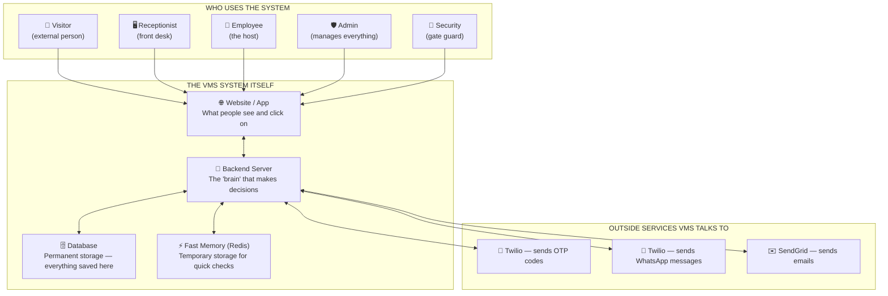

### What each piece does, in plain words:

**The Website/App** — This is what every person sees on their screen. The visitor sees a registration form. The receptionist sees a check-in screen. The admin sees a dashboard. It's all the same system, but each role sees a different "view" based on who they are.

**The Backend Server (the "brain")** — This is the part nobody sees. It's the decision-maker. When a visitor submits a form, the brain decides: is this person verified? Are they on the blacklist? Should I notify the host employee? It runs all the rules.

**The Database** — This is the permanent filing cabinet. Every visitor's name, every visit record, every approval, every check-in time — all of it lives here forever (or until the retention period expires).

**Fast Memory (Redis)** — Think of this as a sticky note pad next to the filing cabinet. Some things need to be checked very quickly and don't need to be permanent — like "did we just send this person an OTP 30 seconds ago?" Redis answers these instantly without digging through the filing cabinet.

**Twilio (OTP)** — A third-party service that sends text messages with verification codes. VMS doesn't send SMS itself — it asks Twilio to do it.

**Twilio (WhatsApp)** — The same company, but a different service — sends WhatsApp messages to employees asking them to approve or reject a visitor.

**SendGrid (Email)** — A third-party service that sends all the emails — QR passes, approval requests, daily reports.

---

## 3. Master Flow — Every Path a Visit Can Take

This is the "map of all roads" — every way a visit can begin and end.

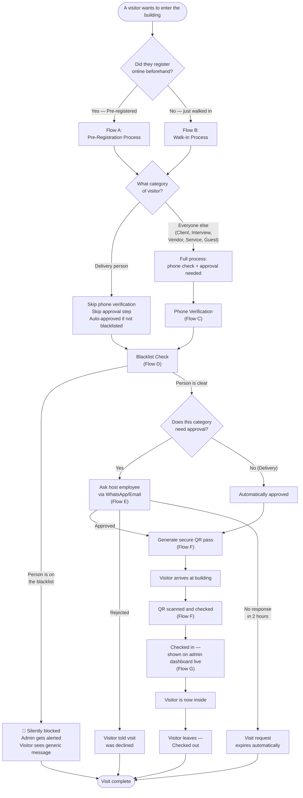

### What this diagram means:

Every visit, no matter how it starts, eventually flows through the same set of checks. The two big decision points are:

1. **Did they register online first, or did they just show up?** This decides whether they go through Flow A (pre-registration) or Flow B (walk-in).

2. **What kind of visitor are they?** A delivery person has a much simpler journey — no phone verification, no waiting for approval. Everyone else goes through the full process.

No matter which path they take, **everyone gets checked against the blacklist** — this is non-negotiable and happens automatically, invisibly, every single time.

---

## 4. Flow A — Pre-Registered Visitor (the ideal case)

This is the best-case scenario — the visitor does everything themselves before arriving, and reception barely has to do anything.

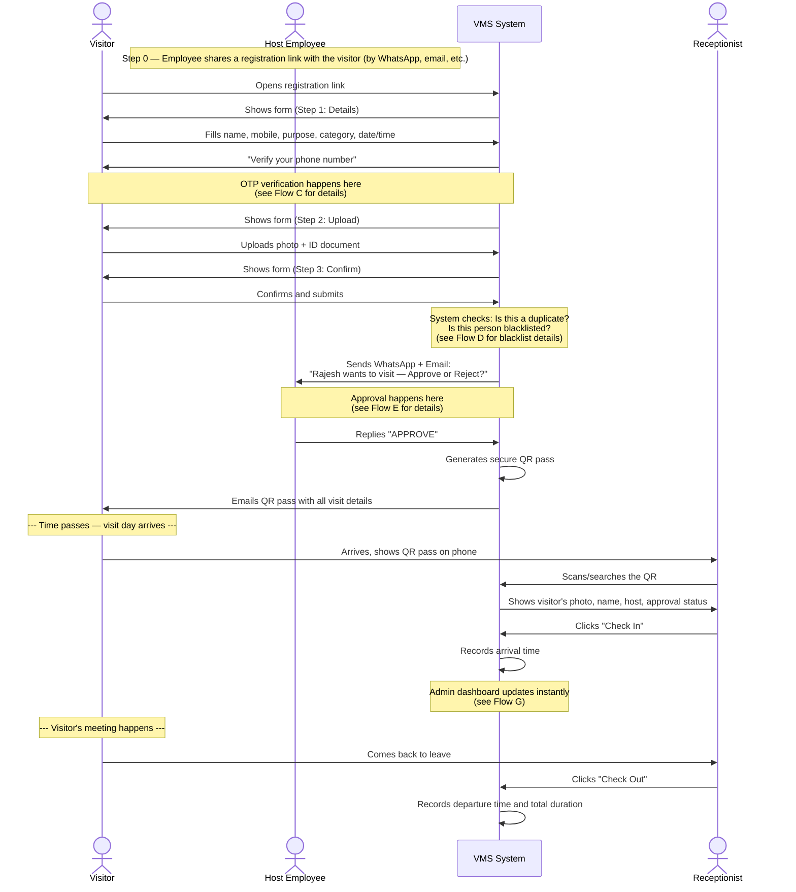

### What this means in plain words:

Think of it like booking a flight and getting a boarding pass:

1. **The employee sends an invitation link** — like sharing a Zoom link, but for a building visit.
2. **The visitor fills out a quick form** on their phone — name, why they're visiting, who they're meeting.
3. **The visitor proves their phone number is real** by entering a code sent via SMS — this stops fake bookings.
4. **The visitor uploads a photo and ID** — just like checking in for international travel.
5. **The system silently runs two background checks**: "Has this person already booked today?" and "Is this person someone we should never let in?"
6. **The host employee gets a WhatsApp message** asking "should I let this person in?" — they tap Approve or Reject right from their phone.
7. **If approved, the visitor gets a digital pass by email** — like an e-ticket, with a QR code that can't be copied or faked.
8. **On the day of the visit**, the visitor shows this pass at reception. The receptionist scans it, sees a profile pop up confirming everything checks out, and taps "Check In" — done in seconds.
9. **When the visitor leaves**, reception taps "Check Out" — the system now knows exactly how long they were inside.

---

## 5. Flow B — Walk-In Visitor (no appointment)

This happens when someone arrives without having registered in advance.

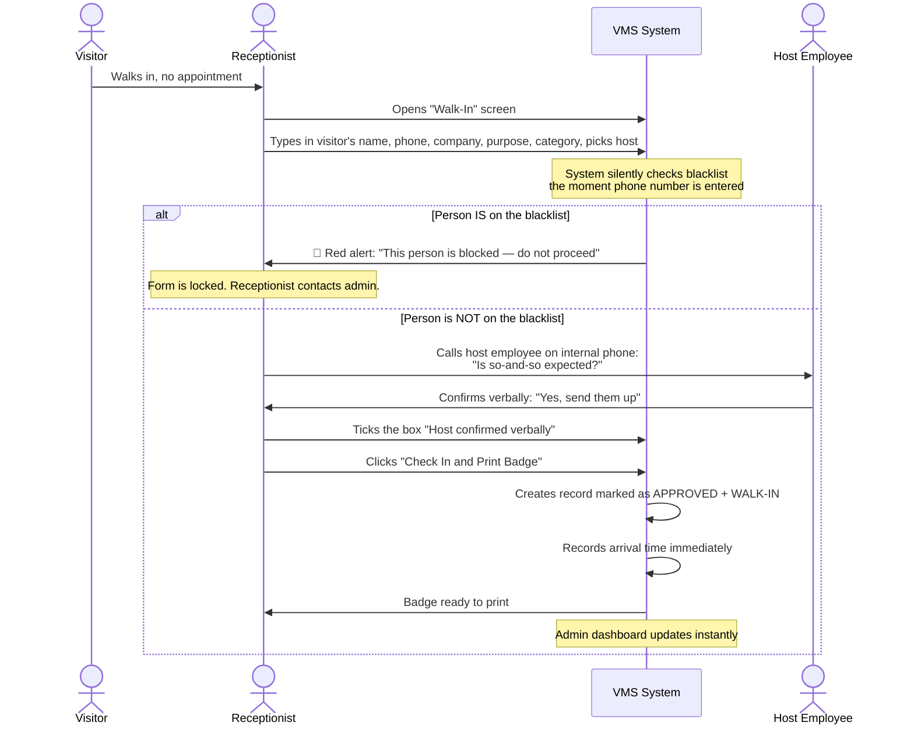

### What this means in plain words:

A walk-in is the "no reservation, but we can still seat you" scenario. The key differences from a pre-registered visitor:

- **No phone verification** — because the receptionist is standing right there looking at the person. Seeing them in person IS the identity check.
- **The blacklist check still happens** — but now it's instant and visible. If the system detects a match, it shows a big red warning right on the receptionist's screen, immediately, before anything else happens.
- **Instead of WhatsApp approval, it's a phone call** — the receptionist calls the employee directly: "Is so-and-so expected?" Once the employee says yes, the receptionist ticks a checkbox confirming this happened, and that's the approval.
- **No QR pass is emailed** — since the visitor is already standing there, they just get a printed badge immediately.

---

## 6. Flow C — OTP Verification in Detail

This zooms into the "verify your phone" step from Flow A.

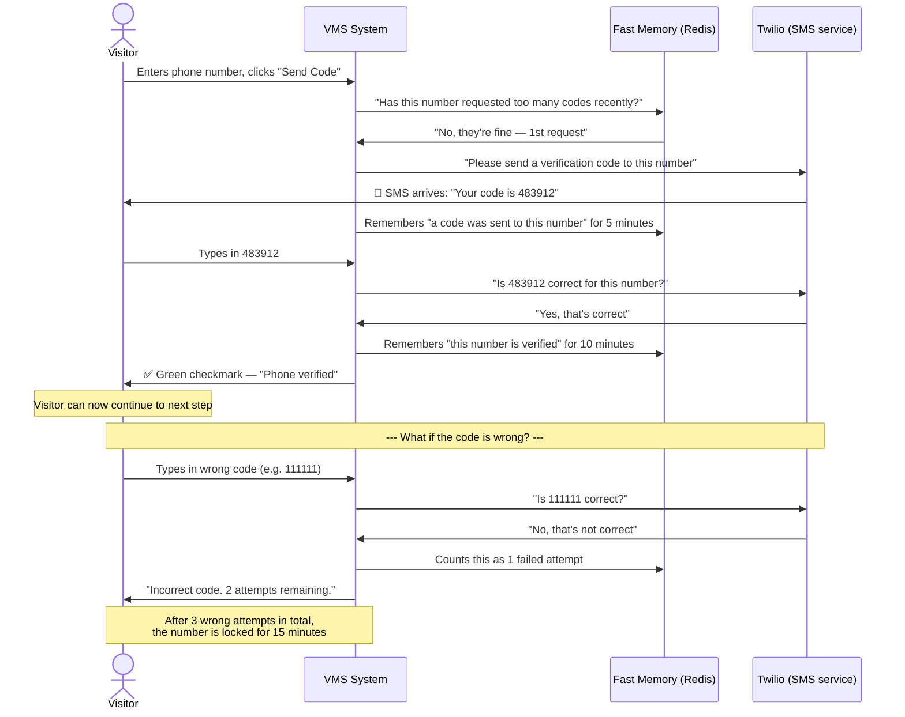

### What this means in plain words:

This is exactly like the "two-factor authentication" you've experienced when logging into your bank or email — the system sends a code to your phone, and you type it back in to prove the phone is really yours.

**Why this matters:** Without this step, anyone could type in someone else's phone number on the form. With this step, you can only continue if you actually have that phone in your hand at that moment.

**The safety limits:**
- You can request a new code at most 3 times per hour (stops someone from spamming a stranger's phone with codes)
- You get 3 tries to enter the correct code before you're locked out for 15 minutes (stops someone guessing random numbers)
- A code expires after 5 minutes (stops someone using an old, possibly intercepted code)

---

## 7. Flow D — Blacklist Check in Detail

This is the security check that runs silently on every single registration — pre-registered or walk-in.

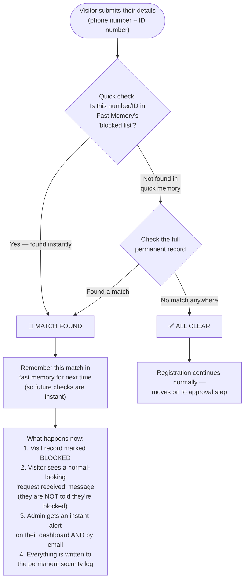

### What this means in plain words:

Imagine a bouncer at a club who has a list of banned people. Every single person who tries to enter — whether they have a reservation or not — gets quietly checked against this list before anything else happens.

**The two-step check:** First, the system checks a "quick memory" list — like the bouncer glancing at a sticky note of recent troublemakers. If it's not there, the system checks the full permanent record — like the bouncer flipping through the complete binder. This two-step approach means the check is almost always instant, but never misses anyone.

**The most important detail:** If someone IS on the blacklist, **they are never told this**. They see the exact same "thanks, we received your request" message as everyone else. Meanwhile, behind the scenes, the admin is immediately notified with a red alert on their screen and an email — "someone on the blacklist just tried to register, here are the details."

This is intentional — it prevents a blocked person from realizing they've been identified and trying a different approach (different phone number, fake ID, etc.).

**Who gets added to this list?** The admin manually adds people — for example, someone who caused a security incident, an employee who was terminated and shouldn't have building access anymore, or someone under a legal restriction. Every addition requires a written reason, and the admin can remove someone from the list later if needed (with the reason kept on file forever for audit purposes).

---

## 8. Flow E — WhatsApp Approval in Detail

This zooms into how the host employee says "yes, let them in" or "no, don't."

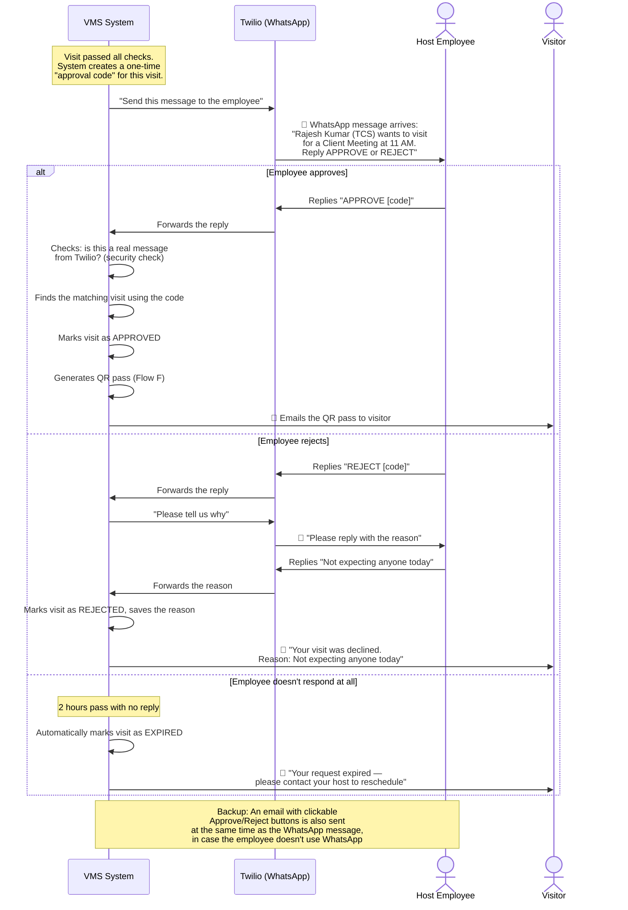

### What this means in plain words:

This is the digital version of a receptionist calling up to an office and asking "hey, do you have a visitor coming?" — except instead of a phone call, it's a WhatsApp message, and the employee can respond from anywhere, even in a meeting, with one tap.

**Why WhatsApp instead of just email?** Most people check WhatsApp within minutes, but emails can sit unread for hours. By using WhatsApp as the main channel (with email as a backup), the visitor doesn't have to stand around waiting.

**The three possible outcomes:**

1. **"APPROVE"** — the employee taps a reply, the system instantly creates a digital pass and emails it to the visitor.
2. **"REJECT"** — the employee taps reject, then the system asks "why?" so there's a record (e.g., "I'm on leave today" or "wrong date"). The visitor is told the visit was declined, along with the reason.
3. **No response within 2 hours** — the system gives up waiting and automatically cancels the request, telling the visitor to contact their host directly.

---

## 9. Flow F — QR Pass: Creation and Scanning

This covers both how the pass is made, and how it's checked when the visitor arrives.

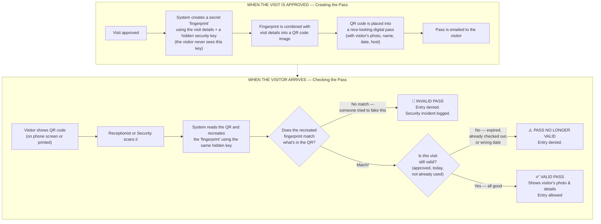

### What this means in plain words:

Think of the QR code like a concert ticket with a hidden hologram. Here's the simple version:

**When creating the pass:** The system takes the visit details (who, when, which visit number) and runs them through a secret formula — using a hidden password that only the system knows. This produces a unique "fingerprint" that gets baked into the QR code. Nobody — not even someone who steals a copy of a valid QR code — can create a new fake one, because they don't know the secret formula or the hidden password.

**When scanning the pass:** The scanner reads the QR code, takes the same visit details out of it, and runs them through the same secret formula again. If the "fingerprint" it gets matches the one stored in the QR code — the pass is genuine. If even a single character was changed to try to forge it, the fingerprints won't match, and the system immediately flags it as a forgery attempt (and logs exactly when and where this happened).

**Extra checks after the fingerprint matches:**
- Is this visit still approved? (not rejected or expired)
- Is today the correct date for this visit?
- Has this pass already been used to check in and check out? (a used pass can't be reused)

This means a QR pass is essentially impossible to forge, and even a genuine pass becomes useless the moment the visit is over.

---

## 10. Flow G — Real-Time Admin Dashboard

This shows how the admin's screen updates the instant something happens anywhere in the building.

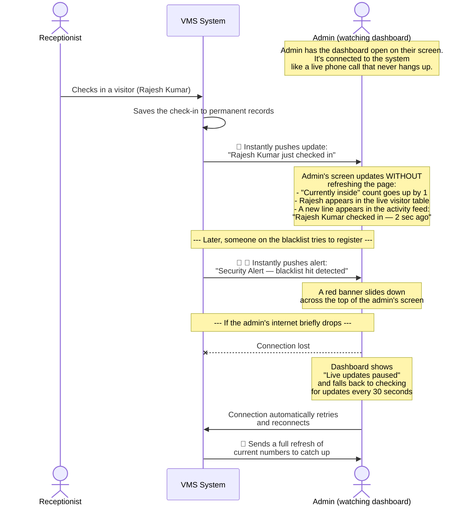

### What this means in plain words:

Without this feature, the admin's dashboard would be like a newspaper — accurate at the moment it was printed, but not updated until the next morning. The admin would have to keep hitting "refresh" to see new information.

With this feature, the dashboard is more like a live sports scoreboard — the moment something happens anywhere in the system (someone checks in, someone gets blocked, an approval comes through), the admin's screen updates immediately, automatically, with no action needed.

**The "always connected" idea:** Think of it like a live video call that stays open in the background. As long as that "call" is connected, any update gets pushed through instantly. If the connection drops for a moment (bad WiFi, etc.), the system notices, shows a small "paused" message, tries to reconnect automatically, and once reconnected, catches the dashboard back up to the current numbers.

---

## 11. Flow H — Daily Report Email (runs automatically)

This happens every single morning without anyone having to do anything.

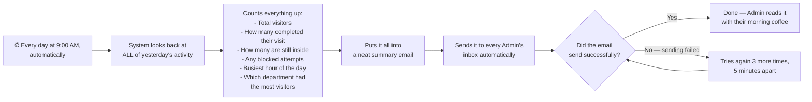

### What this means in plain words:

Imagine if every morning, before you even checked your email, someone had already prepared a one-page summary of everything that happened in the building yesterday — how many people came, who they were visiting, whether anything unusual happened — and put it directly in your inbox.

That's exactly what this feature does. The admin doesn't have to log in, click into reports, or remember to check anything. At 9 AM, it's just... there. If sending the email fails for some reason (a temporary internet issue, for example), the system automatically tries again a few times before giving up — and even then, a record of the attempt is kept so nothing silently disappears.

There's also a manual "Send report now" button for the admin, in case they want to see yesterday's (or any day's) numbers on demand, without waiting for the automatic 9 AM send.

---

## 12. Who Does What — Role Summary

A simple reference table for "who can do what" in the system.

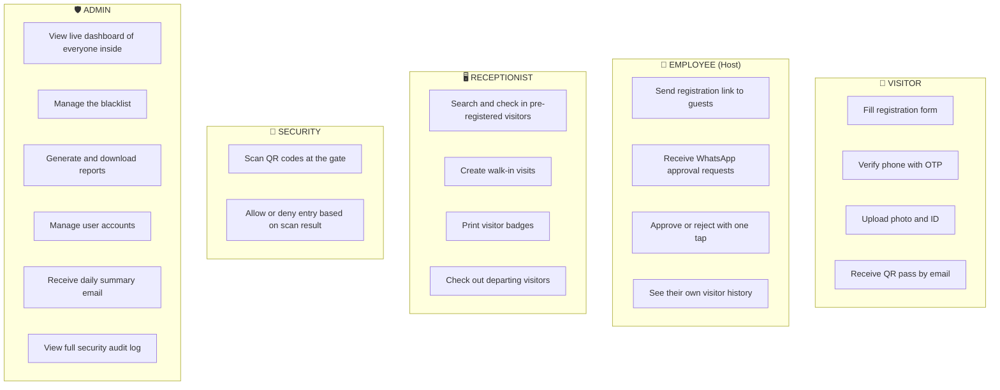

### What this means in plain words:

Each role only sees and does what's relevant to them — nobody is overwhelmed with options they don't need:

- **Visitors** interact with the system for about 3 minutes total, just to register, and that's it.
- **Employees** get a single WhatsApp message per visitor and respond with one word.
- **Receptionists** live in the check-in screen all day — search, check in, print, check out, repeat.
- **Security** has the simplest job of all — scan, see green or red, allow or deny.
- **Admins** see everything — the live building status, security alerts, all reports, and full historical records.

---

## 13. What Happens When Things Go Wrong

Every system has things that can fail. Here's how VMS handles each one, in plain language.

```mermaid
flowchart TD
    subgraph Scenario1["If the SMS/WhatsApp service (Twilio) is down"]
        T1["Visitor can't get OTP code"] --> T2["Registration can still proceed —<br/>reception does a manual ID check instead"]
        T3["Employee doesn't get WhatsApp message"] --> T4["Email approval link still works as backup"]
    end

    subgraph Scenario2["If the Fast Memory (Redis) is down"]
        R1["OTP codes can't be quickly checked"] --> R2["System automatically switches to<br/>checking the permanent database instead<br/>(slightly slower, but still works)"]
    end

    subgraph Scenario3["If the live dashboard connection drops"]
        W1["Admin's screen stops getting<br/>instant updates"] --> W2["Screen shows 'Live updates paused'<br/>and checks for new info every 30 seconds<br/>until reconnected"]
    end

    subgraph Scenario4["If someone tries to use a fake QR code"]
        Q1["QR is scanned"] --> Q2["System detects the fingerprint<br/>doesn't match"] --> Q3["Entry denied immediately +<br/>Security team is alerted +<br/>Incident is permanently logged"]
    end

    subgraph Scenario5["If the same person registers twice for today"]
        D1["Second registration attempt detected"] --> D2["No duplicate record created —<br/>visitor is told their existing<br/>pass was already sent,<br/>with an option to resend it"]
    end
```

### What this means in plain words:

The system is designed so that **no single failure stops the whole process**. Every critical step has a backup plan:

- If text messages can't be sent, the registration desk can do things the old-fashioned way (check ID by eye) without the whole system grinding to a halt.
- If the "fast memory" component fails, everything still works — it just checks the slower, permanent records instead. Visitors and staff won't notice any difference except a tiny delay.
- If the admin's live dashboard loses its connection, it doesn't break — it just switches to "check every 30 seconds" mode until the connection comes back, with a clear message so the admin knows what's happening.
- Fake QR codes are caught instantly and logged — this is one of the most important safety features, because it's the difference between a system that just *looks* secure and one that *actually is* secure.
- Accidental double-bookings don't create messy duplicate records — the system recognizes "you've already done this today" and helps the visitor instead of creating confusion.

---

## Summary — The One-Page Version

If someone asks "how does this whole thing work?", here's the elevator pitch:

1. A visitor gets a link, fills a short form, and proves their phone number is real with a text-message code.
2. The system silently checks: "Have they already registered today?" and "Are they someone we should never let in?"
3. If everything checks out, the host employee gets a WhatsApp message asking "approve or reject?" — one tap decides it.
4. If approved, the visitor gets an email with a secure digital pass that has a unique, unforgeable QR code.
5. On arrival, reception scans the pass, confirms the photo matches, and checks them in — the admin's dashboard updates live, instantly.
6. When the visitor leaves, reception checks them out — the system now has a complete record of the entire visit.
7. Every morning at 9 AM, admins get an automatic email summarizing everything that happened the day before.
8. Walk-ins (people without appointments) follow a simpler path — no phone verification needed, just a verbal confirmation from the host and a quick blacklist check.
9. Delivery personnel skip almost everything — no phone check, no approval wait — they're auto-approved as long as they're not blacklisted, and routed straight to the delivery area.
10. Every security-relevant event — blacklist hits, fake QR attempts, approvals, check-ins — is permanently logged so the whole history can be reviewed at any time.

---

*VMS Architecture & Workflow Guide | v1.0 | June 12, 2025*
*Companion document to VMS-PRD-003 and VMS-SRS-003*
