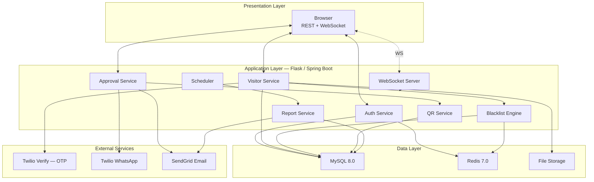

# Software Requirements Specification (SRS) v3.0
**Project:** Visitor Management System (VMS)
**Document ID:** VMS-SRS-003
**Version:** v3.0
**Date:** June 12, 2025
**Architecture:** Final — OTP + Blacklist + WhatsApp + WebSocket + Redis + Signed QR + Duplicate Detection + Scheduled Reports
**Status:** FINAL — Supersedes VMS-SRS-001 and VMS-SRS-002

---

## Table of Contents

1. [Introduction](#1-introduction)
2. [Overall Description](#2-overall-description)
3. [Functional Requirements](#3-functional-requirements)
4. [Non-Functional Requirements](#4-non-functional-requirements)
5. [Database Design](#5-database-design)
6. [Database Indexes](#6-database-indexes)
7. [API Specifications](#7-api-specifications)
8. [Pagination Standard](#8-pagination-standard)
9. [CORS Policy](#9-cors-policy)
10. [File Storage Specification](#10-file-storage-specification)
11. [Test Case Definitions](#11-test-case-definitions)
12. [Requirement Traceability Matrix](#12-requirement-traceability-matrix)

---

## 1. Introduction

### 1.1 Purpose

This SRS v3.0 is the complete and final technical specification for the Visitor Management System. It supersedes VMS-SRS-001 and VMS-SRS-002. Every functional requirement, database table, API endpoint, security rule, and edge case identified across all review cycles is documented here. This is the document developers build against and testers test against.

### 1.2 Scope

VMS v3.0 covers: OTP-verified registration, visitor category routing, duplicate detection, blacklist screening, WhatsApp/email approval, signed QR pass generation and verification, reception check-in/out, walk-in handling, badge printing, real-time admin dashboard, scheduled reporting, and complete audit logging.

### 1.3 Definitions and Acronyms

| Term | Definition |
|------|-----------|
| OTP | One-Time Password — 6-digit code via Twilio Verify |
| TTL | Time To Live — Redis key expiry in seconds |
| HMAC | Hash-based Message Authentication Code |
| JWT | JSON Web Token |
| RBAC | Role-Based Access Control |
| WS | WebSocket |
| Invite Token | Single-use UUID generated by an employee to pre-fill the registration form |
| Approval Token | Single-use UUID embedded in WhatsApp/email approval messages |
| QR Payload | The signed string encoded in the visitor's QR pass |
| Draft | A partially completed registration form saved in Redis |
| PENDING | Visit awaiting employee approval |
| APPROVED | Visit approved, QR pass issued |
| REJECTED | Visit declined by employee |
| BLOCKED | Visit blocked by blacklist engine |
| EXPIRED | No employee response within 2 hours |
| CHECKED_IN | Visitor has arrived and been checked in |
| CHECKED_OUT | Visitor has left |

### 1.4 References

- `VMS-PRD-003` — Product Requirements Document v3.0
- `VMS-SRS-002` — Superseded SRS v2.0
- IEEE Std 830-1998
- Twilio Verify API Docs — `https://www.twilio.com/docs/verify`
- Twilio WhatsApp API Docs — `https://www.twilio.com/docs/whatsapp`
- SendGrid API Docs — `https://docs.sendgrid.com`

---

## 2. Overall Description

### 2.1 System Architecture



### 2.2 External Integrations

| Service | Provider | Purpose | Protocol |
|---------|---------|---------|---------|
| OTP | Twilio Verify | Send/verify 6-digit SMS codes | HTTPS REST |
| WhatsApp | Twilio WhatsApp Business | Send approvals, receive replies | HTTPS REST + Webhook |
| Email | SendGrid | All transactional emails | HTTPS REST |
| Cache | Redis 7.0 | OTP, sessions, drafts, blacklist | Redis protocol :6379 |
| Files | Local filesystem | Photos and ID documents | File I/O |

### 2.3 User Classes

| User Class | Technical Level | Frequency | Access |
|-----------|----------------|-----------|--------|
| Admin | High | Daily | Full system |
| Receptionist | Medium | Continuous | Check-in, walk-in, badges |
| Employee | Low–Medium | Occasional | Approve/reject, invite link |
| Visitor | Low | One-time | Public form only |
| Security | Low | Continuous | QR scan only |

### 2.4 Operating Environment

- **OS:** Linux Ubuntu 20.04+ / Windows Server 2019+
- **Runtime:** Python 3.10+ or Java 17+
- **Database:** MySQL 8.0+
- **Cache:** Redis 7.0+
- **Browser:** Chrome 90+, Firefox 88+, Edge 90+, Safari 14+ with WebSocket support

**Environment variables:**
```
TWILIO_ACCOUNT_SID
TWILIO_AUTH_TOKEN
TWILIO_VERIFY_SID
TWILIO_WHATSAPP_FROM
SENDGRID_API_KEY
REDIS_URL
DATABASE_URL
SECRET_KEY
QR_SECRET_KEY
TIMEZONE=Asia/Kolkata
```

### 2.5 Constraints

- 20 working-day delivery timeline
- Twilio sandbox requires employee opt-in for WhatsApp testing
- File uploads capped at 5MB
- No cloud deployment required — LAN/localhost acceptable for v1

---

## 3. Functional Requirements

### 3.1 Authentication Module

**FR-AUTH-01:** Login via email and password, returns JWT.

**FR-AUTH-02:** JWT-based stateless sessions.

**FR-AUTH-03:** RBAC enforced on all endpoints by role: ADMIN, RECEPTION, EMPLOYEE, SECURITY.

**FR-AUTH-04:** Account locked for 30 minutes after 5 consecutive failed logins.

**FR-AUTH-05:** Passwords hashed with bcrypt, cost factor ≥ 12.

**FR-AUTH-06:** Password reset via email OTP, valid 15 minutes.

---

### 3.2 Invite Token Module — NEW in v3

**FR-INV-01:** Employee SHALL be able to generate an invite link from their dashboard via `POST /api/invites`.

**FR-INV-02:** System SHALL generate a UUID4 token, store it in `InviteTokens` table with EmployeeID, CreatedAt, ExpiresAt = now + 48 hours, UsedAt = NULL.

**FR-INV-03:** The returned link format SHALL be `{BASE_URL}/register?host={employeeId}&token={inviteToken}`.

**FR-INV-04:** When the registration form loads with a valid, unused, unexpired token — the Host Employee field SHALL be pre-filled and the token marked for use.

**FR-INV-05:** On successful visit creation, `InviteTokens.UsedAt` SHALL be set to NOW(). The token cannot pre-fill another form after this.

**FR-INV-06:** If the token is expired, already used, or invalid — the form SHALL load normally without pre-fill. No error is shown to the visitor.

---

### 3.3 OTP Verification Module

**FR-OTP-01:** `POST /api/otp/send` calls Twilio Verify `POST /v2/Services/{SID}/Verifications` with `To={mobile}&Channel=sms`.

**FR-OTP-02:** Twilio verification SID stored in Redis: `SET otp:{mobile} {sid} EX 300`.

**FR-OTP-03:** `POST /api/otp/verify` calls Twilio `POST /v2/Services/{SID}/VerificationChecks` with `VerificationSid` and `Code`.

**FR-OTP-04:** On Twilio `status=approved` — `SET otp_verified:{mobile} 1 EX 600`. Frontend unlocks next step.

**FR-OTP-05:** On Twilio `status=pending` — increment `otp_attempts:{mobile}` (TTL 900s). At count=3, `SET otp_locked:{mobile} 1 EX 900`, return error `OTP_LOCKED`.

**FR-OTP-06:** Form submission rejected with HTTP 400 `OTP_NOT_VERIFIED` if `otp_verified:{mobile}` is absent or `0`.

**FR-OTP-07:** `otp_send_count:{mobile}` (TTL 3600s) capped at 3. Exceeding returns HTTP 429 `OTP_LIMIT_EXCEEDED`.

**FR-OTP-08:** OTP input is a 6-box field, numeric only, auto-advance, auto-submit on 6th digit.

---

### 3.4 Visitor Registration Module

**FR-VIS-01:** Registration form collects: Full Name, Mobile, Email (optional), Company (optional), Visitor Category (required, one of 6), Purpose (10–255 chars), Host Employee, Expected Date (≥ today), Expected Time (8 AM–8 PM).

**FR-VIS-02:** Photo upload — JPEG/PNG, max 2MB, min 200×200px, or webcam capture.

**FR-VIS-03:** Government ID upload — JPEG/PNG/PDF, max 5MB. ID Type required: Aadhaar, Passport, Driver License, Company ID.

**FR-VIS-04:** Mobile number validated as E.164 format.

**FR-VIS-05:** Each visitor gets a unique VisitorID on first registration. Returning visitors (same mobile) reuse the existing VisitorID and update their details.

**FR-VIS-06:** Form submission rejected unless `otp_verified:{mobile} = 1` (FR-OTP-04).

**FR-VIS-07:** On submission, system SHALL run duplicate check (FR-DUP-01) before blacklist check.

**FR-VIS-08:** If duplicate found — return HTTP 200 with existing pass info (FR-DUP-02). No new record created.

**FR-VIS-09:** If no duplicate — system SHALL run blacklist check (FR-BL-01) before creating any record.

**FR-VIS-10:** If blacklist hit — save visit as BLOCKED, return generic message (FR-BL-04). If blacklist clear — create Visitor (if new) and Visit (status=PENDING) records.

---

### 3.5 Visitor Category and Routing Module — NEW in v3

**FR-CAT-01:** System SHALL define exactly 6 visitor categories: CLIENT, INTERVIEW, VENDOR, DELIVERY, SERVICE, GUEST.

**FR-CAT-02:** Each category SHALL have these attributes stored in a `VisitorCategories` config table: CategoryCode, DisplayName, RequiresApproval (bool), RequiresOTP (bool), RequiresBlacklist (bool), BadgeColour (hex), RoutingDestination (text), MaxDurationMinutes (int), RequiredIDTypes (JSON array).

**FR-CAT-03:** DELIVERY category SHALL have `RequiresApproval=false` and `RequiresOTP=false`. All other categories SHALL have both `true`.

**FR-CAT-04:** All categories SHALL have `RequiresBlacklist=true` without exception.

**FR-CAT-05:** When DELIVERY category is selected, the registration form SHALL skip the OTP step entirely and skip the approval workflow — the visit is auto-approved if blacklist clears.

**FR-CAT-06:** The badge generated for a visit SHALL use the `BadgeColour` and `RoutingDestination` from the visitor's selected category.

**FR-CAT-07:** `MaxDurationMinutes` SHALL be used to calculate the "Valid Until" time printed on the badge: `CheckInTime + MaxDurationMinutes`.

---

### 3.6 Blacklist Engine Module

**FR-BL-01:** After duplicate check clears, system SHALL check `Visitors.Mobile` and `Visitors.IDNumber` against the blacklist.

**FR-BL-02:** Check Redis first: `GET blacklist_mobile:{mobile}` and `GET blacklist_id:{idNumber}`. Either hit = blacklist match.

**FR-BL-03:** On Redis miss, query MySQL: `SELECT BlacklistID, Reason FROM Blacklist WHERE (MobileNumber=? OR IDNumber=?) AND IsActive=TRUE LIMIT 1`. On hit, cache to Redis with TTL 3600s.

**FR-BL-04:** On HIT — set Visit.Status=BLOCKED, return generic "request received" message to visitor, emit WebSocket `blacklist_hit` to admin_room, send email alert (template 10.7), log AuditLog action=BLACKLIST_HIT.

**FR-BL-05:** On MISS — proceed with normal visit creation.

**FR-BL-06:** Admin can create blacklist entry: mobile OR ID (at least one required), name (optional), reason (required, ≥10 chars). On save, immediately set Redis keys.

**FR-BL-07:** Admin can deactivate entry — requires confirmation dialog. Sets IsActive=FALSE, DeactivatedAt=NOW(), deletes Redis keys.

**FR-BL-08:** Every check (hit or miss) logged to `BlacklistCheckLog`.

---

### 3.7 Duplicate Visit Detection Module — NEW in v3

**FR-DUP-01:** Before any visit record is created (pre-registration or walk-in), system SHALL execute:
```sql
SELECT v.VisitID, v.Status, v.ExpectedDate, v.ApprovalToken
FROM Visits v JOIN Visitors vis ON v.VisitorID = vis.VisitorID
WHERE vis.Mobile = :mobile
  AND DATE(v.ExpectedDate) = DATE(:expectedDate)
  AND v.Status IN ('PENDING','APPROVED')
LIMIT 1
```

**FR-DUP-02:** If a row is returned for pre-registration flow — return HTTP 200 with message referencing the existing VisitID and an option to resend the pass (`POST /api/visits/{id}/resend-pass`).

**FR-DUP-03:** If a row is returned for walk-in flow — display warning to receptionist with existing VisitID and status. Receptionist may proceed with walk-in anyway (creates a second record, logged) or cancel and use the existing record.

**FR-DUP-04:** `POST /api/visits/{id}/resend-pass` SHALL re-trigger FR-QR-05 (email delivery) without regenerating the QR signature.

---

### 3.8 Approval Workflow Module

**FR-APR-01:** On Visit creation (status=PENDING, category requires approval), generate `ApprovalToken=UUID4()`, store in `Visits.ApprovalToken`.

**FR-APR-02:** Send WhatsApp message (template 10.2) via Twilio to `Employees.Mobile` for the host employee.

**FR-APR-03:** Simultaneously send fallback email (template 10.3) via SendGrid.

**FR-APR-04:** `POST /api/webhooks/twilio/whatsapp` receives replies. Validate `X-Twilio-Signature` via HMAC-SHA1 using TWILIO_AUTH_TOKEN. Return 403 on failure.

**FR-APR-05:** Parse `Body` with regex `(APPROVE|REJECT)\s+([a-zA-Z0-9-]+)`. Query `Visits WHERE ApprovalToken=? AND Status='PENDING'`.

**FR-APR-06:** On APPROVE — set Status=APPROVED, ApprovedAt=NOW(), Channel=WHATSAPP. Trigger FR-QR-01 (QR generation).

**FR-APR-07:** On REJECT — send follow-up WhatsApp asking for reason. Create `PendingWhatsAppReply` record, AwaitingStep=REJECTION_REASON, ExpiresAt=NOW()+10min.

**FR-APR-08:** Next WhatsApp reply from same employee within 10 minutes — if a `PendingWhatsAppReply` exists for them — captured as `Approvals.Remarks`. If no reply within 10 minutes, Remarks="No reason provided".

**FR-APR-09:** On REJECT finalized — set Status=REJECTED, send rejection email (template 10.5) to visitor.

**FR-APR-10:** If no APPROVE/REJECT within 2 hours of creation — scheduled job sets Status=EXPIRED, sends expiry email (template 10.6) to visitor.

**FR-APR-11:** For categories with `RequiresApproval=false` (DELIVERY) — Visit is created directly with Status=APPROVED, no WhatsApp/email sent, QR generated immediately.

---

### 3.9 Signed QR Code Module — NEW in v3

**FR-QR-01:** On Visit Status=APPROVED, generate QR payload: `{visitId}|{visitorId}|{expectedDate}|{hmac}` where `hmac = HMAC-SHA256(QR_SECRET_KEY, "{visitId}|{visitorId}|{expectedDate}")`.

**FR-QR-02:** Generate QR code image from the payload string using python-qrcode (PNG, 400×400px).

**FR-QR-03:** Embed QR image in HTML email (template 10.4), send to visitor via SendGrid.

**FR-QR-04:** `POST /api/qr/verify` accepts a scanned QR string. Splits on `|`, recomputes HMAC, compares using `hmac.compare_digest()` (constant-time).

**FR-QR-05:** If HMAC mismatch — return `{valid: false, reason: "signature_invalid"}`, log AuditLog action=QR_FORGERY_ATTEMPT with truncated QR string and scanner IP, emit WS event `qr_invalid`.

**FR-QR-06:** If HMAC valid but `Visits.Status` not in (APPROVED, CHECKED_IN) — return `{valid: false, reason: "status_invalid", status: "{status}"}`.

**FR-QR-07:** If HMAC valid and date mismatch with today — return `{valid: false, reason: "date_mismatch"}`.

**FR-QR-08:** If all checks pass — return `{valid: true, visit: {...}, visitor: {...}}` including visitor photo URL, name, host, category.

**FR-QR-09:** QR becomes invalid for re-scan once `Visits.Status` = CHECKED_OUT (FR-QR-06 covers this since CHECKED_OUT not in allowed list).

---

### 3.10 Reception Check-In/Out Module

**FR-CHK-01:** Reception searches visitors by name, mobile, or QR scan via `GET /api/visits/search?q={query}`.

**FR-CHK-02:** `POST /api/checkin/{visitId}` — only if `Status=APPROVED`. Creates `CheckInOut` record with `CheckInTime=NOW()`. Sets `Visits.Status=CHECKED_IN`.

**FR-CHK-03:** `POST /api/checkout/{visitId}` — sets `CheckOutTime=NOW()`, calculates `Duration = CheckOutTime - CheckInTime` in minutes. Sets `Visits.Status=CHECKED_OUT`.

**FR-CHK-04:** Check-in rejected with HTTP 403 if `Status != APPROVED` (e.g. attempting to check in a PENDING, BLOCKED, or already CHECKED_IN visit).

**FR-CHK-05:** Reception can generate and print badge via `GET /api/badge/{visitId}` returning an HTML page styled per FR-CAT-06/07, ready for browser print.

**FR-CHK-06:** On check-in, emit WS event `visitor_checked_in` (FR-WS-02). On check-out, emit `visitor_checked_out` (FR-WS-03).

---

### 3.11 Walk-In Module

**FR-WI-01:** `POST /api/visits/walkin` — Reception creates visit directly. Fields: visitor name, mobile, company, category, purpose, host employee, ID type.

**FR-WI-02:** Walk-in SHALL NOT require OTP (FR-OTP-* skipped).

**FR-WI-03:** Walk-in SHALL run FR-DUP-01 — if duplicate found, return warning per FR-DUP-03.

**FR-WI-04:** Walk-in SHALL run FR-BL-01 — if blacklist hit, block the form per FR-BL-04 with an immediate on-screen alert (no silent generic message — receptionist must be informed directly).

**FR-WI-05:** Receptionist SHALL tick "Host confirmed verbally" checkbox before the Check-In button is enabled. This sets `CheckInOut.WalkinHostConfirmed=TRUE`.

**FR-WI-06:** Visit created with `VisitType=WALKIN`, `Status=APPROVED` (no PENDING state for walk-ins), no WhatsApp/email sent.

**FR-WI-07:** Walk-in visit immediately proceeds to check-in (FR-CHK-02) when receptionist clicks "Check In and Print Badge".

---

### 3.12 WebSocket / Real-Time Dashboard Module

**FR-WS-01:** WebSocket server at `/ws/admin`. Flask: Flask-SocketIO room=`admin_room`. Spring Boot: STOMP topic=`/topic/admin`.

**FR-WS-02:** Emit `visitor_checked_in`: `{visitId, visitorName, hostName, checkInTime, department, category}`.

**FR-WS-03:** Emit `visitor_checked_out`: `{visitId, visitorName, checkOutTime, durationMinutes}`.

**FR-WS-04:** Emit `approval_pending`: `{visitId, visitorName, hostName, requestTime, category}`.

**FR-WS-05:** Emit `blacklist_hit`: `{visitorName, mobileMasked, timestamp, reason}`.

**FR-WS-06:** Emit `qr_invalid`: `{timestamp, reason, scannerLocation}`.

**FR-WS-07:** Connection requires valid JWT in handshake. Invalid/expired JWT → close with code 4001.

**FR-WS-08:** Client auto-reconnects: 1s, 2s, 4s, 8s, 16s, 30s (cap), max 10 attempts. On reconnect, client emits `request_full_state`, server responds with current KPIs.

**FR-WS-09:** If WebSocket unreachable, dashboard falls back to `GET /api/admin/dashboard` polling every 30 seconds, with a "Live updates paused" indicator.

---

### 3.13 Redis Module

**FR-RD-01:** Connect on startup via `REDIS_URL`. Pool size=10, timeout=200ms.

**FR-RD-02:** Health check `redis_health_check()` runs `PING` before every OTP/blacklist/draft operation. On `ConnectionError`, log WARNING and route to fallback.

**FR-RD-03:** Fallback table: OTP→MySQL `OTPFallback`, Session→server memory, Blacklist→direct MySQL query, Draft→not saved (form data lost, no error shown to visitor beyond normal behavior).

**FR-RD-04:** All Redis key patterns SHALL match those in PRD Section 6.5/13. No undocumented key patterns permitted.

**FR-RD-05:** On blacklist add/deactivate, immediately `DEL blacklist_mobile:{mobile}` and `DEL blacklist_id:{id}`.

**FR-RD-06:** Redis configured with `requirepass`, bound to `127.0.0.1` only, `maxmemory-policy=allkeys-lru`, `appendonly no`.

---

### 3.14 Session and Draft Module — NEW in v3

**FR-DRAFT-01:** On successful OTP verification (FR-OTP-04), system SHALL save Step 1 form fields to Redis: `SET draft:{sessionId} {json} EX 86400`.

**FR-DRAFT-02:** `sessionId` is a UUID stored in an HttpOnly, Secure, SameSite=Strict cookie, max-age=86400.

**FR-DRAFT-03:** On form load, if draft cookie present and `draft:{sessionId}` exists in Redis — pre-populate Step 1 fields and show banner: "We saved your progress. Continue where you left off?"

**FR-DRAFT-04:** Draft includes OTP-verified status if within original 10-minute verification window (`otp_verified:{mobile}` may have expired — re-verification required if so).

**FR-DRAFT-05:** Draft SHALL NOT include uploaded file paths. Photo and ID must be re-uploaded.

**FR-DRAFT-06:** Draft deleted (`DEL draft:{sessionId}`) on: successful submission, TTL expiry, or visitor clicking "Start over".

---

### 3.15 Scheduled Report Module — NEW in v3

**FR-SCHED-01:** Daily job runs at 09:00 Asia/Kolkata via APScheduler (Flask) or `@Scheduled(cron="0 0 9 * * *")` (Spring Boot).

**FR-SCHED-02:** Job queries previous calendar day per query in PRD Section 14.2.

**FR-SCHED-03:** Renders HTML using template 10.8. If zero visits, still sends with "No visitors recorded yesterday."

**FR-SCHED-04:** Sends via SendGrid to all `Users WHERE Role='ADMIN' AND IsActive=TRUE`.

**FR-SCHED-05:** On SendGrid failure, retry 3× at 5-minute intervals. Log each attempt to AuditLog action=DAILY_REPORT_SEND with status (SUCCESS/RETRY/FAILED).

**FR-SCHED-06:** `POST /api/reports/daily/send-now` — manual trigger button for admin, in case the scheduled job fails (backup per risk mitigation).

---

### 3.16 Admin Dashboard and Reporting Module

**FR-ADM-01:** Dashboard displays: today's visitor count, active visitors, pending approvals, blacklist hits today, live WS event feed (last 20 events).

**FR-ADM-02:** Blacklist management section: view, add, deactivate entries.

**FR-RPT-01:** Daily Visitor Report — visitor list with check-in/out times, hosts, purposes, categories.

**FR-RPT-02:** Monthly Report — visitor count by day and department.

**FR-RPT-03:** Department-Wise Report.

**FR-RPT-04:** All reports exportable as PDF and Excel (XLSX).

**FR-RPT-05:** Reports filterable by date range, department, category.

**FR-RPT-06:** Blacklist Hit Report — Date, Visitor Name, Mobile (masked), ID Type, Reason, Added By.

**FR-RPT-07:** OTP Failure Report — registrations with ≥2 OTP failures, filterable by date.

**FR-RPT-08 (new):** Category Distribution Report — visitor count and percentage by category, for a given date range.

---

## 4. Non-Functional Requirements

### 4.1 Performance

| ID | Requirement |
|----|-------------|
| NFR-PERF-01 | Page load < 3s on standard broadband |
| NFR-PERF-02 | API response < 500ms for 95% of requests |
| NFR-PERF-03 | 500 concurrent users without degradation |
| NFR-PERF-04 | OTP SMS delivered within 10s for 95% of sends |
| NFR-PERF-05 | WhatsApp message delivered within 30s |
| NFR-PERF-06 | WebSocket event received within 500ms of trigger |
| NFR-PERF-07 | Redis ops complete within 10ms for 99% |
| NFR-PERF-08 | Report generation < 5s for 1 month of data |
| NFR-PERF-09 | Reception check-in (pre-registered, approved) completes in < 60 seconds |

### 4.2 Security

| ID | Requirement |
|----|-------------|
| NFR-SEC-01 | bcrypt passwords, cost ≥ 12, never plaintext |
| NFR-SEC-02 | JWT required on all endpoints except public form + Twilio webhook |
| NFR-SEC-03 | Parameterized queries everywhere — no string concatenation in SQL |
| NFR-SEC-04 | All inputs sanitized against XSS |
| NFR-SEC-05 | File uploads: MIME + extension validated, UUID filenames |
| NFR-SEC-06 | HTTPS required in production |
| NFR-SEC-07 | TWILIO_AUTH_TOKEN never logged or exposed |
| NFR-SEC-08 | Twilio webhook HMAC-SHA1 validation, return 403 on failure |
| NFR-SEC-09 | OTP codes never appear in plaintext logs |
| NFR-SEC-10 | Redis: requirepass + localhost-only binding |
| NFR-SEC-11 | ID numbers masked to last 4 digits on all screens |
| NFR-SEC-12 | QR_SECRET_KEY: 32-char random, env var only, never in DB or frontend |
| NFR-SEC-13 | QR verification uses constant-time HMAC comparison |
| NFR-SEC-14 | Draft cookie: HttpOnly, Secure, SameSite=Strict |
| NFR-SEC-15 | Invite tokens and approval tokens are single-use UUID4 |

### 4.3 Reliability

| ID | Requirement |
|----|-------------|
| NFR-REL-01 | Twilio down → email-only approvals, manual ID check note |
| NFR-REL-02 | Redis down → MySQL fallback per FR-RD-03 |
| NFR-REL-03 | WebSocket down → 30s polling fallback with UI indicator |
| NFR-REL-04 | SendGrid failure → 3 retries at 5-min intervals, then log as FAILED |

### 4.4 Usability

| ID | Requirement |
|----|-------------|
| NFR-USE-01 | Responsive 320px–2560px |
| NFR-USE-02 | Registration form completable in < 3 minutes by first-time user |
| NFR-USE-03 | Every error message states the problem and the fix |
| NFR-USE-04 | WCAG AA contrast, full keyboard navigation, ARIA labels |

### 4.5 Maintainability

| ID | Requirement |
|----|-------------|
| NFR-MNT-01 | All endpoints documented in Postman |
| NFR-MNT-02 | Inline comments on all non-trivial functions |
| NFR-MNT-03 | DB schema changes via migration scripts |
| NFR-MNT-04 | All config in `.env`, none hardcoded |

### 4.6 Data Retention

| Data | Retention |
|------|-----------|
| Visitor records | 1 year after visit |
| OTP logs | 90 days |
| Audit log | 2 years |
| Uploaded files | 90 days after check-out |
| Blacklist entries | Indefinite, even if deactivated |
| BlacklistCheckLog | 1 year |

---

## 5. Database Design

### 5.1 Table: Users

| Column | Type | Constraints | Description |
|--------|------|-------------|-------------|
| UserID | INT | PK, AUTO_INCREMENT | Unique identifier |
| Name | VARCHAR(100) | NOT NULL | Full name |
| Email | VARCHAR(150) | UNIQUE, NOT NULL | Login email |
| PasswordHash | VARCHAR(255) | NOT NULL | bcrypt hash |
| Role | ENUM | NOT NULL | ADMIN, RECEPTION, EMPLOYEE, SECURITY |
| IsActive | BOOLEAN | DEFAULT TRUE | Account status |
| FailedLoginCount | INT | DEFAULT 0 | For FR-AUTH-04 |
| LockedUntil | DATETIME | NULLABLE | Lockout expiry |
| CreatedAt | DATETIME | DEFAULT NOW() | Created timestamp |
| LastLogin | DATETIME | NULLABLE | Last login |

### 5.2 Table: Employees

| Column | Type | Constraints | Description |
|--------|------|-------------|-------------|
| EmployeeID | INT | PK, FK(Users.UserID) | Links to Users |
| Department | VARCHAR(100) | NOT NULL | Department name |
| Designation | VARCHAR(100) | NULLABLE | Job title |
| Mobile | VARCHAR(15) | NOT NULL | WhatsApp approval number |
| NotificationPref | ENUM | DEFAULT 'BOTH' | WHATSAPP, EMAIL, BOTH |

### 5.3 Table: InviteTokens — NEW in v3

| Column | Type | Constraints | Description |
|--------|------|-------------|-------------|
| TokenID | INT | PK, AUTO_INCREMENT | Unique ID |
| Token | VARCHAR(36) | UNIQUE, NOT NULL | UUID4 |
| EmployeeID | INT | FK(Employees) | Generating employee |
| CreatedAt | DATETIME | DEFAULT NOW() | Created |
| ExpiresAt | DATETIME | NOT NULL | CreatedAt + 48h |
| UsedAt | DATETIME | NULLABLE | When consumed |

### 5.4 Table: VisitorCategories — NEW in v3

| Column | Type | Constraints | Description |
|--------|------|-------------|-------------|
| CategoryCode | VARCHAR(20) | PK | CLIENT, INTERVIEW, VENDOR, DELIVERY, SERVICE, GUEST |
| DisplayName | VARCHAR(50) | NOT NULL | Shown in UI |
| RequiresApproval | BOOLEAN | NOT NULL | True for all except DELIVERY |
| RequiresOTP | BOOLEAN | NOT NULL | True for all except DELIVERY |
| RequiresBlacklist | BOOLEAN | DEFAULT TRUE | Always true |
| BadgeColour | VARCHAR(7) | NOT NULL | Hex colour code |
| RoutingDestination | VARCHAR(100) | NOT NULL | e.g. "Delivery bay" |
| MaxDurationMinutes | INT | NOT NULL | For badge "Valid Until" |
| RequiredIDTypes | JSON | NOT NULL | Array of accepted ID types |

### 5.5 Table: Visitors

| Column | Type | Constraints | Description |
|--------|------|-------------|-------------|
| VisitorID | INT | PK, AUTO_INCREMENT | Unique visitor |
| Name | VARCHAR(100) | NOT NULL | Full name |
| Mobile | VARCHAR(15) | NOT NULL, INDEXED | Contact number |
| MobileVerified | BOOLEAN | DEFAULT FALSE | OTP status |
| Email | VARCHAR(150) | NULLABLE | Email |
| Company | VARCHAR(150) | NULLABLE | Organisation |
| IDType | VARCHAR(50) | NOT NULL | Aadhaar/Passport/DL/Company ID |
| IDNumber | VARCHAR(50) | NOT NULL, INDEXED | For blacklist matching |
| IDProofPath | VARCHAR(255) | NOT NULL | Server file path |
| PhotoPath | VARCHAR(255) | NOT NULL | Server file path |
| CreatedAt | DATETIME | DEFAULT NOW() | Registration time |

### 5.6 Table: Visits

| Column | Type | Constraints | Description |
|--------|------|-------------|-------------|
| VisitID | INT | PK, AUTO_INCREMENT | Unique visit |
| VisitorID | INT | FK(Visitors), INDEXED | Visitor |
| EmployeeID | INT | FK(Employees) | Host |
| CategoryCode | VARCHAR(20) | FK(VisitorCategories) | Visit category |
| Purpose | VARCHAR(255) | NOT NULL | Reason |
| ExpectedDate | DATETIME | NOT NULL, INDEXED | Scheduled date/time |
| Status | ENUM | NOT NULL, INDEXED | PENDING/APPROVED/REJECTED/BLOCKED/EXPIRED/CHECKED_IN/CHECKED_OUT |
| VisitType | ENUM | DEFAULT 'PREREG' | PREREG, WALKIN |
| QRPayload | TEXT | NULLABLE | Full signed QR string |
| ApprovalToken | VARCHAR(36) | NULLABLE, UNIQUE | Approval workflow token |
| InviteTokenID | INT | FK(InviteTokens), NULLABLE | If created via invite link |
| CreatedAt | DATETIME | DEFAULT NOW() | Creation time |

### 5.7 Table: Approvals

| Column | Type | Constraints | Description |
|--------|------|-------------|-------------|
| ApprovalID | INT | PK, AUTO_INCREMENT | Unique record |
| VisitID | INT | FK(Visits), UNIQUE | One per visit |
| ApprovedBy | INT | FK(Users), NULLABLE | Acting user (NULL for auto-approve) |
| Channel | ENUM | NOT NULL | WHATSAPP, EMAIL, MANUAL, AUTO |
| Status | ENUM | NOT NULL | APPROVED, REJECTED |
| Remarks | TEXT | NULLABLE | Rejection reason |
| ActionAt | DATETIME | DEFAULT NOW() | Timestamp |

### 5.8 Table: CheckInOut

| Column | Type | Constraints | Description |
|--------|------|-------------|-------------|
| CheckID | INT | PK, AUTO_INCREMENT | Unique record |
| VisitID | INT | FK(Visits), INDEXED | Visit |
| CheckInTime | DATETIME | NOT NULL | Entry time |
| CheckOutTime | DATETIME | NULLABLE | Exit time |
| Duration | INT | NULLABLE | Minutes |
| ProcessedBy | INT | FK(Users) | Receptionist |
| WalkinHostConfirmed | BOOLEAN | DEFAULT FALSE | FR-WI-05 |

### 5.9 Table: Blacklist

| Column | Type | Constraints | Description |
|--------|------|-------------|-------------|
| BlacklistID | INT | PK, AUTO_INCREMENT | Unique entry |
| MobileNumber | VARCHAR(15) | NULLABLE, INDEXED | Blocked mobile |
| IDNumber | VARCHAR(50) | NULLABLE, INDEXED | Blocked ID |
| VisitorName | VARCHAR(100) | NULLABLE | Reference name |
| Reason | TEXT | NOT NULL | Why blocked |
| AddedBy | INT | FK(Users), NOT NULL | Admin |
| IsActive | BOOLEAN | DEFAULT TRUE | Currently enforced |
| CreatedAt | DATETIME | DEFAULT NOW() | Created |
| DeactivatedAt | DATETIME | NULLABLE | Deactivated time |

### 5.10 Table: BlacklistCheckLog

| Column | Type | Constraints | Description |
|--------|------|-------------|-------------|
| LogID | INT | PK, AUTO_INCREMENT | Unique log |
| VisitID | INT | FK(Visits), NOT NULL | Visit checked |
| CheckedMobile | VARCHAR(15) | NOT NULL | Mobile checked |
| CheckedIDNumber | VARCHAR(50) | NULLABLE | ID checked |
| Result | ENUM | NOT NULL | HIT, MISS |
| BlacklistID | INT | FK(Blacklist), NULLABLE | Match if HIT |
| CheckedAt | DATETIME | DEFAULT NOW() | Timestamp |

### 5.11 Table: PendingWhatsAppReply

| Column | Type | Constraints | Description |
|--------|------|-------------|-------------|
| PendingID | INT | PK, AUTO_INCREMENT | Unique tracker |
| VisitID | INT | FK(Visits), NOT NULL | Visit |
| EmployeeMobile | VARCHAR(15) | NOT NULL | Whose reply is captured |
| AwaitingStep | ENUM | NOT NULL | REJECTION_REASON, NONE |
| CreatedAt | DATETIME | DEFAULT NOW() | Created |
| ExpiresAt | DATETIME | NOT NULL | +10 minutes |

### 5.12 Table: AuditLog

| Column | Type | Constraints | Description |
|--------|------|-------------|-------------|
| LogID | INT | PK, AUTO_INCREMENT | Unique entry |
| Action | VARCHAR(50) | NOT NULL, INDEXED | e.g. CHECKIN, BLACKLIST_HIT, QR_FORGERY_ATTEMPT |
| PerformedBy | INT | FK(Users), NULLABLE | NULL for system/visitor actions |
| TargetType | VARCHAR(50) | NULLABLE | VISIT, USER, BLACKLIST, etc. |
| TargetID | INT | NULLABLE | Affected record ID |
| Details | TEXT | NULLABLE | Description |
| IPAddress | VARCHAR(45) | NULLABLE | Client IP |
| CreatedAt | DATETIME | DEFAULT NOW(), INDEXED | Timestamp |

### 5.13 Table: OTPFallback — NEW in v3

| Column | Type | Constraints | Description |
|--------|------|-------------|-------------|
| FallbackID | INT | PK, AUTO_INCREMENT | Unique entry |
| Mobile | VARCHAR(15) | NOT NULL, INDEXED | Phone number |
| VerificationSID | VARCHAR(50) | NOT NULL | Twilio SID |
| Verified | BOOLEAN | DEFAULT FALSE | Verification status |
| Attempts | INT | DEFAULT 0 | Failed attempt count |
| ExpiresAt | DATETIME | NOT NULL | Manual expiry (replaces Redis TTL) |
| CreatedAt | DATETIME | DEFAULT NOW() | Created |

> Used only when Redis is unreachable (FR-RD-03). A cleanup job deletes expired rows daily.

---

## 6. Database Indexes

| Table | Index | Columns | Reason |
|-------|-------|---------|--------|
| Visitors | idx_visitor_mobile | Mobile | Blacklist + duplicate checks |
| Visitors | idx_visitor_id | IDNumber | Blacklist checks |
| Visits | idx_visit_status | Status | Dashboard KPI queries |
| Visits | idx_visit_date | ExpectedDate | Duplicate check + reports |
| Visits | idx_visit_visitor | VisitorID | Join performance |
| Visits | idx_visit_token | ApprovalToken | Webhook lookup |
| Blacklist | idx_bl_mobile | MobileNumber | FR-BL-03 fallback query |
| Blacklist | idx_bl_id | IDNumber | FR-BL-03 fallback query |
| AuditLog | idx_audit_action | Action | Filtering by action type |
| AuditLog | idx_audit_created | CreatedAt | Date-range queries |
| CheckInOut | idx_checkin_visit | VisitID | Join performance |
| OTPFallback | idx_otp_mobile | Mobile | Fallback lookup |

All indexes SHALL be created via migration scripts (NFR-MNT-03), not manually in production.

---

## 7. API Specifications

### 7.1 Base URLs

```
REST API:   http://localhost:5000/api   (dev)
WebSocket:  ws://localhost:5000/ws/admin
```

### 7.2 Authentication Header

```
Authorization: Bearer {JWT}
```

Required on all endpoints **except**: `/auth/login`, `/visitors/register`, `/otp/send`, `/otp/verify`, `/qr/verify` (public scan), `/webhooks/twilio/whatsapp` (Twilio signature instead), `/visits/{id}/resend-pass` (token-based).

### 7.3 Endpoint Reference

#### Authentication
| Method | Endpoint | Auth | Description |
|--------|----------|------|-------------|
| POST | `/auth/login` | No | Returns JWT |
| POST | `/auth/logout` | Yes | Invalidate session |
| POST | `/auth/reset-password` | No | Trigger reset OTP |

#### Invites (NEW)
| Method | Endpoint | Auth | Description |
|--------|----------|------|-------------|
| POST | `/invites` | Yes (Employee) | Generate invite link |

#### OTP
| Method | Endpoint | Auth | Description |
|--------|----------|------|-------------|
| POST | `/otp/send` | No | Send OTP via Twilio Verify |
| POST | `/otp/verify` | No | Verify OTP code |

#### Visitors / Visits
| Method | Endpoint | Auth | Description |
|--------|----------|------|-------------|
| POST | `/visitors/register` | No | Pre-registration submission |
| POST | `/visits/walkin` | Yes (Reception) | Walk-in creation |
| POST | `/visits/{id}/resend-pass` | No (token) | Resend QR pass email |
| GET | `/visits/search?q=` | Yes (Reception) | Search by name/mobile/QR |
| GET | `/visits/pending` | Yes (Employee) | List pending approvals |
| POST | `/visits/{id}/approve` | Yes (Employee) | Approve via UI |
| POST | `/visits/{id}/reject` | Yes (Employee) | Reject via UI |

#### Check-in/out
| Method | Endpoint | Auth | Description |
|--------|----------|------|-------------|
| POST | `/checkin/{visitId}` | Yes (Reception) | Check in |
| POST | `/checkout/{visitId}` | Yes (Reception) | Check out |
| GET | `/badge/{visitId}` | Yes (Reception) | Printable badge HTML |

#### QR
| Method | Endpoint | Auth | Description |
|--------|----------|------|-------------|
| POST | `/qr/verify` | Yes (Security/Reception) | Verify scanned QR payload |

#### Blacklist
| Method | Endpoint | Auth | Description |
|--------|----------|------|-------------|
| GET | `/blacklist?page=&limit=` | Yes (Admin) | Paginated list |
| POST | `/blacklist` | Yes (Admin) | Add entry |
| PATCH | `/blacklist/{id}/deactivate` | Yes (Admin) | Deactivate entry |
| GET | `/blacklist/check?mobile=&id=` | Yes | Manual check |

#### Admin / Reports
| Method | Endpoint | Auth | Description |
|--------|----------|------|-------------|
| GET | `/admin/dashboard` | Yes (Admin) | KPI data |
| GET | `/reports/daily?date=` | Yes (Admin) | Daily report |
| GET | `/reports/monthly?month=` | Yes (Admin) | Monthly report |
| GET | `/reports/department?from=&to=` | Yes (Admin) | Department report |
| GET | `/reports/blacklist-hits?from=&to=` | Yes (Admin) | Blacklist hit report |
| GET | `/reports/otp-failures?from=&to=` | Yes (Admin) | OTP failure report |
| GET | `/reports/categories?from=&to=` | Yes (Admin) | Category distribution |
| POST | `/reports/daily/send-now` | Yes (Admin) | Manual daily report trigger |
| POST | `/users` | Yes (Admin) | Create user |
| PATCH | `/users/{id}` | Yes (Admin) | Update user |
| GET | `/audit-log?page=&limit=&action=` | Yes (Admin) | Paginated audit log |

#### Webhooks
| Method | Endpoint | Auth | Description |
|--------|----------|------|-------------|
| POST | `/webhooks/twilio/whatsapp` | Twilio Sig | Receive WhatsApp replies |

---

## 8. Pagination Standard

All list endpoints (`/blacklist`, `/audit-log`, `/visits`, `/users`) SHALL implement this pagination contract.

**Request query parameters:**
```
?page=1&limit=25
```
- `page` default = 1, minimum = 1
- `limit` default = 25, maximum = 100

**Response envelope:**
```json
{
  "data": [ /* array of records */ ],
  "pagination": {
    "page": 1,
    "limit": 25,
    "total_records": 312,
    "total_pages": 13
  }
}
```

**FR-PAG-01:** Every list endpoint SHALL return this envelope structure.

**FR-PAG-02:** `total_records` SHALL be computed via `SELECT COUNT(*)` with the same WHERE clause as the data query.

**FR-PAG-03:** Requesting a `page` beyond `total_pages` SHALL return an empty `data` array with HTTP 200 (not an error).

---

## 9. CORS Policy

**NFR-CORS-01:** The backend SHALL set the following CORS headers for all `/api/*` routes:

```
Access-Control-Allow-Origin: {FRONTEND_URL}   (from env var, not '*')
Access-Control-Allow-Methods: GET, POST, PATCH, DELETE, OPTIONS
Access-Control-Allow-Headers: Content-Type, Authorization
Access-Control-Allow-Credentials: true
```

**NFR-CORS-02:** The public registration form (`/visitors/register`, `/otp/*`) MAY be served from a different subdomain than the admin/reception app. Both origins SHALL be added to the allowed origins list as a comma-separated env var `ALLOWED_ORIGINS`.

**NFR-CORS-03:** `OPTIONS` preflight requests SHALL be handled before authentication middleware — preflight requests do not carry the Authorization header.

**NFR-CORS-04:** The Twilio webhook endpoint and QR verify endpoint SHALL NOT require CORS headers configured for browser origins — they are called server-to-server (Twilio) or from the same-origin scanner app.

---

## 10. File Storage Specification

### 10.1 Directory Structure

```
/uploads
  /visitors
    /2025
      /06
        /10
          {uuid}.jpg          (photo)
          {uuid}.pdf          (ID document)
```

**FR-FILE-01:** Files SHALL be stored under `/uploads/visitors/{YYYY}/{MM}/{DD}/{uuid}.{ext}`.

**FR-FILE-02:** The `{uuid}` SHALL be generated server-side using UUID4. The original uploaded filename SHALL NEVER be used as the stored filename or exposed in any URL.

**FR-FILE-03:** Allowed extensions: `.jpg`, `.jpeg`, `.png` (photos); `.jpg`, `.jpeg`, `.png`, `.pdf` (ID documents). Any other extension SHALL be rejected with HTTP 400.

**FR-FILE-04:** MIME type SHALL be verified server-side using file content inspection (magic bytes), not just the file extension or `Content-Type` header — both can be spoofed.

**FR-FILE-05:** Maximum file sizes: photo 2MB, ID document 5MB. Files exceeding this SHALL be rejected with HTTP 413 before being written to disk.

**FR-FILE-06:** File serving SHALL go through an authenticated endpoint `GET /api/files/{uuid}` that checks the requesting user's role has permission to view that visitor's record — files SHALL NOT be served directly from a public static directory.

**FR-FILE-07:** A daily cleanup job SHALL delete files where the associated `Visits.CheckOutTime` is more than 90 days old (Section 4.6 data retention).

---

## 11. Test Case Definitions

This section defines the test cases referenced in the Traceability Matrix. Each test case includes preconditions, steps, and expected result.

### TC-OTP-01 — Send OTP successfully

- **Precondition:** Valid mobile number, `otp_send_count:{mobile}` < 3
- **Steps:** POST `/api/otp/send` with valid E.164 mobile
- **Expected:** HTTP 200, Twilio Verification created, Redis key `otp:{mobile}` exists with TTL 300

### TC-OTP-02 — Verify correct OTP

- **Precondition:** OTP sent (TC-OTP-01 passed)
- **Steps:** POST `/api/otp/verify` with correct 6-digit code
- **Expected:** HTTP 200, `otp_verified:{mobile}=1` in Redis with TTL 600

### TC-OTP-03 — Lockout after 3 failed attempts

- **Precondition:** OTP sent
- **Steps:** POST `/api/otp/verify` with incorrect code 3 times
- **Expected:** 3rd attempt returns HTTP 423 `OTP_LOCKED`, `otp_locked:{mobile}=1` set with TTL 900

### TC-OTP-04 — Reject submission without OTP verification

- **Precondition:** No OTP sent for this mobile
- **Steps:** POST `/api/visitors/register` with all fields valid but no prior OTP verify
- **Expected:** HTTP 400 `OTP_NOT_VERIFIED`

### TC-OTP-05 — OTP send rate limit

- **Precondition:** `otp_send_count:{mobile}=3`
- **Steps:** POST `/api/otp/send` a 4th time
- **Expected:** HTTP 429 `OTP_LIMIT_EXCEEDED`

### TC-BL-01 — Blacklist hit by mobile

- **Precondition:** Mobile `+919999999999` exists in Blacklist with `IsActive=TRUE`
- **Steps:** Submit registration with this mobile, OTP verified, no duplicate
- **Expected:** Visit created with `Status=BLOCKED`, generic message returned, AuditLog has `BLACKLIST_HIT`

### TC-BL-02 — Redis hot-path hit

- **Precondition:** `blacklist_mobile:+919999999999` exists in Redis
- **Steps:** Submit registration with this mobile
- **Expected:** No MySQL query to Blacklist table (verify via query log), same result as TC-BL-01

### TC-BL-03 — Admin alert on blacklist hit

- **Precondition:** Same as TC-BL-01
- **Steps:** Submit registration; observe admin dashboard
- **Expected:** WebSocket `blacklist_hit` event received within 500ms; email sent to all ADMIN users

### TC-BL-04 — Add blacklist entry

- **Precondition:** Logged in as Admin
- **Steps:** POST `/api/blacklist` with `{mobile: "+918888888888", reason: "Security incident"}`
- **Expected:** HTTP 201, row in Blacklist, Redis key `blacklist_mobile:+918888888888` set

### TC-BL-05 — Deactivate blacklist entry

- **Precondition:** Active blacklist entry exists
- **Steps:** PATCH `/api/blacklist/{id}/deactivate`
- **Expected:** `IsActive=FALSE`, `DeactivatedAt` set, Redis keys deleted, subsequent registration with that mobile is NOT blocked

### TC-DUP-01 — Duplicate detection blocks second registration

- **Precondition:** Visitor with mobile X has a PENDING visit for today
- **Steps:** Same visitor (mobile X) submits registration again for today
- **Expected:** HTTP 200, no new Visit row created, response references existing VisitID

### TC-DUP-02 — Different date allows new registration

- **Precondition:** Visitor with mobile X has APPROVED visit for today
- **Steps:** Same visitor submits registration for tomorrow
- **Expected:** New Visit row created normally

### TC-DUP-03 — Walk-in duplicate warning

- **Precondition:** Visitor with mobile X has APPROVED pre-registered visit for today
- **Steps:** Receptionist creates walk-in with mobile X
- **Expected:** Warning shown referencing existing VisitID; receptionist can proceed or cancel

### TC-APR-01 — WhatsApp approval via reply

- **Precondition:** Visit PENDING, ApprovalToken known, employee has joined Twilio sandbox
- **Steps:** Send WhatsApp message "APPROVE {token}" from employee's number
- **Expected:** Webhook receives request, signature valid, Visit status → APPROVED, QR generated, email sent to visitor

### TC-APR-02 — Email fallback sent

- **Precondition:** Visit created (PENDING)
- **Steps:** Observe outgoing emails
- **Expected:** Email sent to employee within same transaction as WhatsApp send

### TC-APR-03 — Webhook signature rejection

- **Precondition:** None
- **Steps:** POST to `/api/webhooks/twilio/whatsapp` with invalid/missing `X-Twilio-Signature`
- **Expected:** HTTP 403, request not processed, logged

### TC-APR-04 — Auto-expiry after 2 hours

- **Precondition:** Visit PENDING, created > 2 hours ago
- **Steps:** Run scheduled expiry job
- **Expected:** Status → EXPIRED, visitor receives expiry email

### TC-QR-01 — Valid QR scan

- **Precondition:** Visit APPROVED, QR generated correctly
- **Steps:** POST `/api/qr/verify` with the correct QR payload
- **Expected:** `{valid: true, visit: {...}}`

### TC-QR-02 — Forged QR rejected

- **Precondition:** None
- **Steps:** POST `/api/qr/verify` with payload where HMAC is tampered (e.g. last char changed)
- **Expected:** `{valid: false, reason: "signature_invalid"}`, AuditLog `QR_FORGERY_ATTEMPT` created

### TC-QR-03 — Expired/checked-out QR rejected

- **Precondition:** Visit Status=CHECKED_OUT, QR otherwise valid (correct HMAC)
- **Steps:** POST `/api/qr/verify` with this QR
- **Expected:** `{valid: false, reason: "status_invalid", status: "CHECKED_OUT"}`

### TC-CHK-01 — Check-in emits WebSocket event

- **Precondition:** Visit APPROVED, admin dashboard connected via WS
- **Steps:** POST `/api/checkin/{visitId}`
- **Expected:** `visitor_checked_in` event received by admin client within 500ms

### TC-CHK-02 — Cannot check in non-approved visit

- **Precondition:** Visit Status=PENDING
- **Steps:** POST `/api/checkin/{visitId}`
- **Expected:** HTTP 403

### TC-WI-01 — Walk-in skips OTP

- **Precondition:** Receptionist logged in
- **Steps:** POST `/api/visits/walkin` with valid visitor details, category=CLIENT
- **Expected:** HTTP 201, Visit created with `VisitType=WALKIN`, `Status=APPROVED`, no OTP-related Redis keys touched

### TC-WI-02 — Walk-in still checks blacklist

- **Precondition:** Mobile in walk-in form matches an active Blacklist entry
- **Steps:** POST `/api/visits/walkin` with that mobile
- **Expected:** HTTP 403 or on-screen alert, visit NOT created, AuditLog `BLACKLIST_HIT` recorded

### TC-WS-01 — WebSocket connects with valid JWT

- **Precondition:** Admin has valid JWT
- **Steps:** Open WS connection to `/ws/admin` with JWT in handshake
- **Expected:** Connection established, joined to `admin_room`

### TC-WS-02 — WebSocket rejects invalid JWT

- **Precondition:** Expired or malformed JWT
- **Steps:** Open WS connection with bad JWT
- **Expected:** Connection closed with code 4001

### TC-RD-01 — Redis fallback on connection failure

- **Precondition:** Redis service stopped
- **Steps:** Trigger OTP send
- **Expected:** OTP flow completes using `OTPFallback` MySQL table, WARNING logged

### TC-RD-02 — Redis recovery resumes normal path

- **Precondition:** Redis was down (TC-RD-01), now restarted
- **Steps:** Trigger OTP send
- **Expected:** Health check passes, Redis path used again

### TC-SCHED-01 — Daily report sends at 9 AM

- **Precondition:** At least one visit exists for yesterday
- **Steps:** Trigger scheduled job (or call manually for test)
- **Expected:** Email sent to all ADMIN users with correct summary data

### TC-SCHED-02 — Daily report with zero visits

- **Precondition:** No visits exist for yesterday
- **Steps:** Trigger scheduled job
- **Expected:** Email sent with "No visitors recorded yesterday"

### TC-DRAFT-01 — Draft saved and restored

- **Precondition:** Visitor completes Step 1 + OTP, closes browser
- **Steps:** Visitor reopens registration link within 24 hours, same browser (cookie present)
- **Expected:** Step 1 fields pre-populated, banner shown

### TC-DRAFT-02 — Draft expires after 24 hours

- **Precondition:** Draft saved 25 hours ago
- **Steps:** Visitor reopens registration link
- **Expected:** Form loads empty, no banner

### TC-CAT-01 — Delivery category skips OTP and approval

- **Precondition:** None
- **Steps:** Submit registration with category=DELIVERY, no OTP step shown/required
- **Expected:** Visit created directly with `Status=APPROVED`, QR generated immediately, no WhatsApp/email sent to employee

### TC-SEC-01 — ID number masking

- **Precondition:** Visitor record with `IDNumber=123456789012`
- **Steps:** View visitor details on any screen (reception, admin, security)
- **Expected:** Displayed as `****9012` everywhere, full number never in API response to frontend

---

## 12. Requirement Traceability Matrix

| Req ID | Requirement | Module | Test Case | Status |
|--------|-------------|--------|-----------|--------|
| FR-AUTH-01 | Login returns JWT | Auth | — | v1 |
| FR-INV-01 | Generate invite link | Invite | — | v3 |
| FR-INV-04 | Pre-fill host from token | Invite | — | v3 |
| FR-OTP-01 | Send OTP via Twilio | OTP | TC-OTP-01 | v2 |
| FR-OTP-04 | Mark phone verified | OTP | TC-OTP-02 | v2 |
| FR-OTP-05 | Lockout after 3 failures | OTP | TC-OTP-03 | v2 |
| FR-OTP-06 | Block submit without OTP | OTP | TC-OTP-04 | v2 |
| FR-OTP-07 | Rate limit OTP sends | OTP | TC-OTP-05 | v2 |
| FR-CAT-03 | DELIVERY skips approval/OTP | Category | TC-CAT-01 | v3 |
| FR-CAT-06 | Badge uses category colour | Category | — | v3 |
| FR-DUP-01 | Duplicate check before creation | Duplicate | TC-DUP-01, TC-DUP-02 | v3 |
| FR-DUP-03 | Walk-in duplicate warning | Duplicate | TC-DUP-03 | v3 |
| FR-BL-01 | Blacklist check on registration | Blacklist | TC-BL-01 | v2 |
| FR-BL-02 | Redis hot-path lookup | Blacklist | TC-BL-02 | v2 |
| FR-BL-04 | Admin alert on hit | Blacklist | TC-BL-03 | v2 |
| FR-BL-06 | Add blacklist entry | Blacklist | TC-BL-04 | v2 |
| FR-BL-07 | Deactivate blacklist entry | Blacklist | TC-BL-05 | v2 |
| FR-APR-02 | WhatsApp approval send | Approval | TC-APR-01 | v2 |
| FR-APR-03 | Email fallback | Approval | TC-APR-02 | v2 |
| FR-APR-04 | Webhook HMAC validation | Approval | TC-APR-03 | v2 |
| FR-APR-10 | Auto-expire after 2 hours | Approval | TC-APR-04 | v2 |
| FR-QR-01 | Signed QR generation | QR | — | v3 |
| FR-QR-04 | QR verify endpoint | QR | TC-QR-01 | v3 |
| FR-QR-05 | Forged QR detection | QR | TC-QR-02 | v3 |
| FR-QR-06 | Status-invalid QR rejection | QR | TC-QR-03 | v3 |
| FR-CHK-02 | Check-in creates record | Check-in | — | v1 |
| FR-CHK-04 | Reject check-in if not approved | Check-in | TC-CHK-02 | v1 |
| FR-CHK-06 | Emit WS event on check-in | Check-in | TC-CHK-01 | v2 |
| FR-WI-02 | Walk-in skips OTP | Walk-in | TC-WI-01 | v2 |
| FR-WI-04 | Walk-in checks blacklist | Walk-in | TC-WI-02 | v3 |
| FR-WS-01 | WS admin room connection | Dashboard | TC-WS-01 | v2 |
| FR-WS-07 | JWT validation on WS connect | Dashboard | TC-WS-02 | v2 |
| FR-RD-02 | Redis health check + fallback | Cache | TC-RD-01, TC-RD-02 | v2 |
| FR-DRAFT-01 | Draft saved to Redis | Draft | TC-DRAFT-01 | v3 |
| FR-DRAFT-06 | Draft expires/deleted | Draft | TC-DRAFT-02 | v3 |
| FR-SCHED-01 | Daily report at 9 AM | Scheduler | TC-SCHED-01, TC-SCHED-02 | v3 |
| FR-PAG-01 | Pagination envelope | Pagination | — | v3 |
| NFR-SEC-11 | ID masking | Security | TC-SEC-01 | v2 |
| NFR-SEC-12 | QR_SECRET_KEY isolation | Security | — | v3 |
| NFR-CORS-01 | CORS headers on /api/* | CORS | — | v3 |
| FR-FILE-02 | UUID filenames | Files | — | v3 |
| FR-FILE-04 | Magic-byte MIME validation | Files | — | v3 |

---

*VMS-SRS-003 | v3.0 | June 12, 2025 | 20-Day Software Development Internship Program*
*This document supersedes VMS-SRS-001 and VMS-SRS-002*
