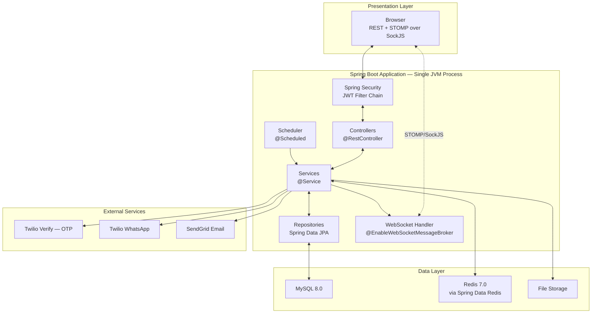

# Software Requirements Specification (SRS) v4.0
**Project:** Visitor Management System (VMS)
**Document ID:** VMS-SRS-004
**Version:** v4.0
**Date:** June 16, 2025
**Architecture:** Final — Spring Boot 3.2 + OTP + Blacklist + WhatsApp + WebSocket + Redis + Signed QR + Duplicate Detection + Scheduled Reports
**Status:** FINAL — Supersedes VMS-SRS-001, VMS-SRS-002, VMS-SRS-003. Backend locked to Spring Boot.

---

## Table of Contents

1. [Introduction](#1-introduction)
2. [Overall Description](#2-overall-description)
3. [Functional Requirements](#3-functional-requirements)
4. [Non-Functional Requirements](#4-non-functional-requirements)
5. [Database Design — JPA Entities](#5-database-design--jpa-entities)
6. [Database Indexes](#6-database-indexes)
7. [API Specifications](#7-api-specifications)
8. [Pagination Standard](#8-pagination-standard)
9. [CORS Policy](#9-cors-policy)
10. [File Storage Specification](#10-file-storage-specification)
11. [Spring Security Configuration](#11-spring-security-configuration)
12. [Test Case Definitions](#12-test-case-definitions)
13. [Requirement Traceability Matrix](#13-requirement-traceability-matrix)

---

## 1. Introduction

### 1.1 Purpose

This SRS v4.0 is the complete and final technical specification for the Visitor Management System, with the backend locked to **Spring Boot 3.2 on Java 17**. It supersedes all prior SRS versions and removes every dual-framework reference (Flask vs Spring Boot) present in VMS-SRS-002 and VMS-SRS-003. Every code sample in this document is Spring Boot-specific and ready to use as a starting point for implementation.

### 1.2 Scope

Unchanged from v3.0: OTP-verified registration, visitor category routing, duplicate detection, blacklist screening, WhatsApp/email approval, signed QR pass generation and verification, reception check-in/out, walk-in handling, badge printing, real-time admin dashboard, scheduled reporting, and complete audit logging — all implemented as a single Spring Boot monolith.

### 1.3 Definitions and Acronyms

| Term | Definition |
|------|-----------|
| OTP | One-Time Password — 6-digit code via Twilio Verify |
| TTL | Time To Live — Redis key expiry in seconds |
| HMAC | Hash-based Message Authentication Code |
| JWT | JSON Web Token |
| RBAC | Role-Based Access Control |
| STOMP | Simple Text Oriented Messaging Protocol — used over Spring WebSocket |
| JPA | Java Persistence API — Spring Data's ORM abstraction |
| DTO | Data Transfer Object — used to shape API request/response bodies separately from JPA entities |
| Bean | A Spring-managed Java object, instantiated and wired by the Spring container |
| Repository | A Spring Data JPA interface that auto-generates database queries |
| Invite Token | Single-use UUID generated by an employee to pre-fill the registration form |
| Approval Token | Single-use UUID embedded in WhatsApp/email approval messages |
| QR Payload | The signed string encoded in the visitor's QR pass |
| Draft | A partially completed registration form saved in Redis |

### 1.4 References

- `VMS-PRD-004` — Product Requirements Document v4.0
- `VMS-SRS-003` — Superseded SRS v3.0
- Spring Boot 3.2 Reference Documentation — `https://docs.spring.io/spring-boot/docs/current/reference/html/`
- Spring Data JPA Documentation — `https://docs.spring.io/spring-data/jpa/reference/`
- Twilio Java SDK — `https://www.twilio.com/docs/libraries/java`
- ZXing Documentation — `https://github.com/zxing/zxing`

---

## 2. Overall Description

### 2.1 System Architecture



### 2.2 External Integrations

| Service | Provider | Purpose | Java Library |
|---------|---------|---------|--------------|
| OTP | Twilio Verify | Send/verify 6-digit SMS codes | `com.twilio.sdk:twilio` |
| WhatsApp | Twilio WhatsApp Business | Send approvals, receive replies | `com.twilio.sdk:twilio` |
| Email | SendGrid | All transactional emails | `com.sendgrid:sendgrid-java` |
| Cache | Redis 7.0 | OTP, sessions, drafts, blacklist | `spring-boot-starter-data-redis` |
| QR Code | — | Generate/decode QR images | `com.google.zxing:core` + `javase` |
| Files | Local filesystem | Photos and ID documents | Java NIO (`java.nio.file`) |

### 2.3 User Classes

Unchanged from v3.0: Admin, Receptionist, Employee, Visitor, Security — see PRD Section 5.1 for the full permissions matrix.

### 2.4 Operating Environment

- **OS:** Linux Ubuntu 20.04+ / Windows Server 2019+
- **JDK:** Java 17 (LTS) — required minimum for Spring Boot 3.x
- **Build Tool:** Maven 3.9+
- **Database:** MySQL 8.0+
- **Cache:** Redis 7.0+
- **Browser:** Chrome 90+, Firefox 88+, Edge 90+, Safari 14+ with WebSocket/SockJS support

**`application.yml` configuration:**
```yaml
spring:
  application:
    name: vms-backend
  datasource:
    url: jdbc:mysql://localhost:3306/vms_db
    username: ${DB_USERNAME}
    password: ${DB_PASSWORD}
  jpa:
    hibernate:
      ddl-auto: validate
    show-sql: false
  data:
    redis:
      host: localhost
      port: 6379
      password: ${REDIS_PASSWORD}

twilio:
  account-sid: ${TWILIO_ACCOUNT_SID}
  auth-token: ${TWILIO_AUTH_TOKEN}
  verify:
    service-sid: ${TWILIO_VERIFY_SID}
  whatsapp:
    from: ${TWILIO_WHATSAPP_FROM}

sendgrid:
  api-key: ${SENDGRID_API_KEY}

app:
  qr-secret-key: ${QR_SECRET_KEY}
  frontend-url: ${FRONTEND_URL}
  jwt:
    secret: ${JWT_SECRET}
    expiration-ms: 28800000
```

### 2.5 Constraints

- 20 working-day delivery timeline
- Single Spring Boot monolith — no microservices split
- Maven build only — no Gradle
- Twilio sandbox requires employee opt-in for WhatsApp testing
- File uploads capped at 5MB

---

## 3. Functional Requirements

> **Convention:** `SHALL` = mandatory, `SHOULD` = recommended, `MAY` = optional. Each requirement below specifies the responsible Spring Boot component (Controller / Service / Repository) for implementation clarity.

### 3.1 Authentication Module

**FR-AUTH-01:** `POST /api/auth/login` (handled by `AuthController`) SHALL authenticate via email/password against `UserRepository`, returning a JWT signed with `app.jwt.secret`.

**FR-AUTH-02:** Authentication SHALL be stateless — Spring Security configured with `SessionCreationPolicy.STATELESS` in `SecurityConfig`.

**FR-AUTH-03:** RBAC SHALL be enforced via `@PreAuthorize("hasRole('ADMIN')")` annotations on controller methods, backed by a custom `JwtAuthenticationFilter`.

**FR-AUTH-04:** `UserService.recordFailedLogin()` SHALL increment `failedLoginCount` on the `User` entity; at 5, set `lockedUntil = now() + 30 minutes`.

**FR-AUTH-05:** Passwords SHALL be hashed using Spring Security's `BCryptPasswordEncoder` with strength 12.

**FR-AUTH-06:** Password reset SHALL use the same `TwilioVerifyService` OTP flow as visitor registration, valid 15 minutes.

---

### 3.2 Invite Token Module

**FR-INV-01:** `POST /api/invites` (`InviteController`, `@PreAuthorize("hasRole('EMPLOYEE')")`) SHALL generate an invite link.

**FR-INV-02:** `InviteTokenService.create()` SHALL generate a `UUID.randomUUID()` token, persist via `InviteTokenRepository`, with `expiresAt = now().plusHours(48)`.

**FR-INV-03:** Returned link format: `{app.frontend-url}/register?host={employeeId}&token={inviteToken}`.

**FR-INV-04:** On form load with a valid token, `InviteTokenService.findValid(token)` SHALL return the associated employee for pre-fill.

**FR-INV-05:** On successful visit creation, `InviteTokenService.consume(token)` SHALL set `usedAt = now()` inside a `@Transactional` method to prevent race conditions on concurrent use.

**FR-INV-06:** Expired, used, or invalid tokens SHALL cause the form to load without pre-fill — no error surfaced to the visitor.

---

### 3.3 OTP Verification Module

**FR-OTP-01:** `POST /api/otp/send` (`OtpController`) SHALL call `TwilioVerifyService.sendOtp()`, which invokes `Verification.creator(verifyServiceSid, mobile, "sms").create()` from the Twilio Java SDK.

**FR-OTP-02:** The returned Verification SID SHALL be stored via `RedisTemplate<String,String>.opsForValue().set("otp:"+mobile, sid, Duration.ofMinutes(5))`.

**FR-OTP-03:** `POST /api/otp/verify` SHALL call `VerificationCheck.creator(verifyServiceSid).setTo(mobile).setCode(code).create()`.

**FR-OTP-04:** On `status.equals("approved")` — `redisTemplate.opsForValue().set("otp_verified:"+mobile, "1", Duration.ofMinutes(10))`.

**FR-OTP-05:** On non-approved status, `redisTemplate.opsForValue().increment("otp_attempts:"+mobile)`. At 3, set `otp_locked:{mobile}` with TTL 15 minutes, throw `OtpLockedException` (mapped to HTTP 423 via `@ControllerAdvice`).

**FR-OTP-06:** `VisitorController.register()` SHALL reject submission with HTTP 400 (`OtpNotVerifiedException`) if `otp_verified:{mobile}` is absent in Redis.

**FR-OTP-07:** `redisTemplate.opsForValue().increment("otp_send_count:"+mobile)` capped at 3 per hour; exceeding throws `OtpLimitExceededException` mapped to HTTP 429.

**FR-OTP-08:** Frontend OTP field is a 6-box numeric input, auto-advance, auto-submit on 6th digit — JavaScript implementation, framework-agnostic.

---

### 3.4 Visitor Registration Module

**FR-VIS-01:** `VisitorController.register()` accepts a `VisitorRegistrationDto` validated via `@Valid` and Hibernate Validator annotations (`@NotBlank`, `@Pattern`, `@Future`).

**FR-VIS-02:** Photo upload handled via `@RequestParam("photo") MultipartFile photo` — validated for size (`spring.servlet.multipart.max-file-size=2MB`) and content type.

**FR-VIS-03:** ID document upload via `@RequestParam("idDocument") MultipartFile idDocument`, max 5MB.

**FR-VIS-04:** Mobile validated via `@Pattern(regexp = "^\\+[1-9]\\d{1,14}$")` (E.164 format) on the DTO field.

**FR-VIS-05:** `VisitorService.findOrCreate(mobile)` SHALL reuse an existing `Visitor` entity if the mobile number is already known, updating other fields; otherwise creates a new entity.

**FR-VIS-06:** Submission rejected unless `otp_verified:{mobile}` exists in Redis (cross-checked in `VisitService.registerVisit()` before any entity is persisted).

**FR-VIS-07:** `VisitService.registerVisit()` SHALL call `visitRepository.findDuplicateVisit()` (FR-DUP-01) before any persistence operation.

**FR-VIS-08:** On duplicate found, return HTTP 200 with existing visit reference — no new entity created.

**FR-VIS-09:** If no duplicate, `BlacklistService.check()` (FR-BL-01) SHALL run before entity creation.

**FR-VIS-10:** On blacklist clear, `Visitor` and `Visit` entities SHALL be persisted inside a single `@Transactional` service method.

---

### 3.5 Visitor Category and Routing Module

**FR-CAT-01:** Six categories (`CLIENT`, `INTERVIEW`, `VENDOR`, `DELIVERY`, `SERVICE`, `GUEST`) SHALL be represented as a `VisitorCategory` JPA entity, seeded via a Flyway migration script, not hardcoded as a Java enum (allows admin editing without redeploy).

**FR-CAT-02:** `VisitorCategory` entity fields: `categoryCode`, `displayName`, `requiresApproval`, `requiresOtp`, `requiresBlacklist`, `badgeColour`, `routingDestination`, `maxDurationMinutes`, `requiredIdTypes` (stored as JSON via `@JdbcTypeCode(SqlTypes.JSON)` — Hibernate 6 native JSON column support).

**FR-CAT-03:** `DELIVERY` category SHALL have `requiresApproval=false`, `requiresOtp=false`. All others `true`.

**FR-CAT-04:** All categories SHALL have `requiresBlacklist=true` — enforced by a database `CHECK` constraint as a defense-in-depth measure in addition to application logic.

**FR-CAT-05:** `VisitService` SHALL branch on `category.isRequiresOtp()` to skip the OTP gate, and `category.isRequiresApproval()` to skip the WhatsApp/email approval step, auto-setting `status=APPROVED` directly.

**FR-CAT-06:** `BadgeService.render()` SHALL read `badgeColour` and `routingDestination` from the visit's linked `VisitorCategory` when generating the Thymeleaf badge template.

**FR-CAT-07:** Badge "Valid Until" SHALL be computed as `checkInTime.plusMinutes(category.getMaxDurationMinutes())`.

---

### 3.6 Blacklist Engine Module

**FR-BL-01:** `BlacklistService.check(mobile, idNumber)` SHALL run after duplicate check clears.

**FR-BL-02:** Redis check via `redisTemplate.hasKey("blacklist_mobile:"+mobile)` and `hasKey("blacklist_id:"+idNumber)`.

**FR-BL-03:** On Redis miss, `BlacklistRepository.findFirstByMobileNumberOrIdNumberAndIsActiveTrue()` (Spring Data JPA derived query) queries MySQL. On hit, cache to Redis with TTL 1 hour.

**FR-BL-04:** On hit — set `Visit.status=BLOCKED`, publish `BlacklistHitEvent` via `ApplicationEventPublisher.publishEvent()`. Two independent `@EventListener` methods react: one sends admin email, one broadcasts WebSocket alert.

**FR-BL-05:** On miss — proceed with normal visit creation.

**FR-BL-06:** `POST /api/blacklist` (`@PreAuthorize("hasRole('ADMIN')")`) creates a `Blacklist` entity; service immediately sets corresponding Redis keys.

**FR-BL-07:** `PATCH /api/blacklist/{id}/deactivate` sets `isActive=false`, `deactivatedAt=now()`, deletes Redis keys via `redisTemplate.delete()`.

**FR-BL-08:** Every check logged via `BlacklistCheckLogRepository.save()`.

---

### 3.7 Duplicate Visit Detection Module

**FR-DUP-01:** `VisitRepository` SHALL expose:
```java
@Query("SELECT v FROM Visit v WHERE v.visitor.mobile = :mobile " +
       "AND CAST(v.expectedDate AS date) = :date " +
       "AND v.status IN ('PENDING','APPROVED')")
Optional<Visit> findDuplicateVisit(@Param("mobile") String mobile, @Param("date") LocalDate date);
```

**FR-DUP-02:** On match for pre-registration flow, `VisitController` SHALL return HTTP 200 referencing the existing visit, with a `resend-pass` action link.

**FR-DUP-03:** On match for walk-in flow, `WalkInController` SHALL return a warning DTO; receptionist may proceed (creates a logged second record) or cancel.

**FR-DUP-04:** `POST /api/visits/{id}/resend-pass` SHALL re-trigger `SendGridEmailService.sendQrPass()` without regenerating the QR signature (same signed payload re-sent).

---

### 3.8 Approval Workflow Module

**FR-APR-01:** On `Visit` creation where `category.isRequiresApproval()=true`, `ApprovalService.initiateApproval()` SHALL generate `approvalToken = UUID.randomUUID().toString()`.

**FR-APR-02:** `TwilioWhatsAppService.sendApprovalRequest()` SHALL call `Message.creator(...)` with the formatted message body.

**FR-APR-03:** `SendGridEmailService.sendApprovalFallback()` SHALL fire in parallel via `@Async` (configured with `@EnableAsync` and a dedicated `TaskExecutor` bean).

**FR-APR-04:** `WhatsAppWebhookController` at `POST /api/webhooks/twilio/whatsapp` SHALL validate `X-Twilio-Signature` via `TwilioSignatureValidator.isValid(request)` before processing.

**FR-APR-05:** `ApprovalService.processWhatsAppReply()` SHALL parse the body with a regex pattern and look up `Visit` by `approvalToken` where `status='PENDING'`.

**FR-APR-06:** On APPROVE — `visit.setStatus(APPROVED)`, persist, trigger `QrCodeService.generate()`.

**FR-APR-07:** On REJECT — create `PendingWhatsAppReply` entity with `awaitingStep=REJECTION_REASON`, `expiresAt=now().plusMinutes(10)`, send follow-up WhatsApp message.

**FR-APR-08:** Next webhook call from the same employee mobile SHALL be checked against `PendingWhatsAppReplyRepository.findActiveByMobile()` before being treated as a new command.

**FR-APR-09:** On rejection finalized — `visit.setStatus(REJECTED)`, send rejection email via `SendGridEmailService`.

**FR-APR-10:** `@Scheduled(fixedRate = 600000)` job in `ExpiryScheduler` SHALL find all `PENDING` visits older than 2 hours and set `status=EXPIRED`, sending expiry emails.

**FR-APR-11:** For categories with `requiresApproval=false`, `VisitService` SHALL set `status=APPROVED` directly with `Approval.channel=AUTO`, skip Twilio/SendGrid calls, and trigger QR generation immediately.

---

### 3.9 Signed QR Code Module

**FR-QR-01:** `QrSigner.sign(visitId, visitorId, expectedDate)` SHALL compute `HMAC-SHA256` using `javax.crypto.Mac` with the secret from `app.qr-secret-key`, returning `{visitId}|{visitorId}|{expectedDate}|{hexHash}`.

**FR-QR-02:** `QrCodeService.generateQrImage()` SHALL use `com.google.zxing.qrcode.QRCodeWriter` to produce a 400×400px PNG.

**FR-QR-03:** QR image SHALL be embedded in a Thymeleaf email template, sent via `SendGridEmailService`.

**FR-QR-04:** `POST /api/qr/verify` (`QrController`) SHALL accept a scanned payload, delegate to `QrSigner.verify()`.

**FR-QR-05:** `QrSigner.verify()` SHALL use `java.security.MessageDigest.isEqual()` for constant-time hash comparison — never `String.equals()`, which is vulnerable to timing attacks.

**FR-QR-06:** On HMAC mismatch — return `{valid: false, reason: "signature_invalid"}`, log `AuditLogService.record("QR_FORGERY_ATTEMPT", ...)`, publish WebSocket event.

**FR-QR-07:** On HMAC valid but `Visit.status` not in `{APPROVED, CHECKED_IN}` — return `{valid: false, reason: "status_invalid"}`.

**FR-QR-08:** On HMAC valid but date mismatch — return `{valid: false, reason: "date_mismatch"}`.

**FR-QR-09:** On all checks passing — return `{valid: true, visit: {...}, visitor: {...}}` including a signed, time-limited URL to the visitor's photo.

---

### 3.10 Reception Check-In/Out Module

**FR-CHK-01:** `GET /api/visits/search?q={query}` (`CheckInController`) SHALL search by name, mobile, or QR payload using a Spring Data JPA `Specification` for dynamic querying.

**FR-CHK-02:** `POST /api/checkin/{visitId}` SHALL create a `CheckInOut` entity only if `visit.getStatus() == APPROVED`, else throw `InvalidCheckInStateException` (mapped to HTTP 403).

**FR-CHK-03:** `POST /api/checkout/{visitId}` SHALL set `checkOutTime=now()`, compute `duration = Duration.between(checkInTime, checkOutTime).toMinutes()`.

**FR-CHK-04:** Covered by FR-CHK-02's exception handling.

**FR-CHK-05:** `GET /api/badge/{visitId}` SHALL render a Thymeleaf template (`badge.html`) styled per FR-CAT-06/07.

**FR-CHK-06:** On check-in/check-out, `DashboardNotifier.notifyCheckedIn()` / `notifyCheckedOut()` SHALL broadcast via `SimpMessagingTemplate.convertAndSend("/topic/admin", event)`.

---

### 3.11 Walk-In Module

**FR-WI-01:** `POST /api/visits/walkin` (`WalkInController`, `@PreAuthorize("hasRole('RECEPTION')")`).

**FR-WI-02:** `WalkInService` SHALL NOT call `TwilioVerifyService` at any point in this code path.

**FR-WI-03:** `WalkInService` SHALL call the same `VisitRepository.findDuplicateVisit()` method used in pre-registration (FR-DUP-01) — one shared code path, not a duplicated implementation.

**FR-WI-04:** `WalkInService` SHALL call the same `BlacklistService.check()` used in pre-registration (FR-BL-01) — again, one shared service, not a separate implementation, ensuring the rule can never be bypassed by accident.

**FR-WI-05:** `CheckInOut.walkinHostConfirmed` SHALL be set `true` only when the receptionist explicitly confirms via the checkbox in the request DTO.

**FR-WI-06:** `Visit.visitType=WALKIN`, `Visit.status=APPROVED` set directly by `WalkInService`, with `Approval.channel=MANUAL`.

**FR-WI-07:** Check-in (FR-CHK-02) SHALL be callable immediately after walk-in visit creation in the same UI flow.

---

### 3.12 WebSocket / Real-Time Dashboard Module

**FR-WS-01:** `WebSocketConfig` (`@EnableWebSocketMessageBroker`) SHALL register endpoint `/ws/admin` with SockJS fallback, broker prefix `/topic`, application prefix `/app`.

**FR-WS-02:** `DashboardNotifier.notifyCheckedIn()` SHALL broadcast a `CheckInEvent` DTO to `/topic/admin`.

**FR-WS-03:** `DashboardNotifier.notifyCheckedOut()` SHALL broadcast a `CheckOutEvent` DTO.

**FR-WS-04:** `DashboardNotifier.notifyApprovalPending()` SHALL broadcast an `ApprovalPendingEvent` DTO.

**FR-WS-05:** The `@EventListener` reacting to `BlacklistHitEvent` SHALL broadcast a `BlacklistHitWsEvent` DTO with masked mobile.

**FR-WS-06:** The `@EventListener` reacting to QR forgery SHALL broadcast a `QrInvalidEvent` DTO.

**FR-WS-07:** WebSocket handshake SHALL be intercepted by a custom `ChannelInterceptor` validating the JWT passed in STOMP `CONNECT` headers. Invalid JWT SHALL cause connection rejection.

**FR-WS-08:** Frontend (Stomp.js client) SHALL implement reconnect with backoff: 1s, 2s, 4s, 8s, 16s, 30s (cap), max 10 attempts.

**FR-WS-09:** On WebSocket unavailability, frontend SHALL fall back to `GET /api/admin/dashboard` polling every 30 seconds with a "Live updates paused" UI indicator.

---

### 3.13 Redis Module

**FR-RD-01:** `RedisConfig` SHALL configure a `LettuceConnectionFactory` with pool size 10, command timeout 200ms, sourced from `application.yml`.

**FR-RD-02:** `RedisHealthChecker.isAvailable()` SHALL `ping()` the connection before OTP/blacklist/draft operations; on `RedisConnectionFailureException`, log WARNING and route to fallback.

**FR-RD-03:** Fallback paths: OTP → `OtpFallbackRepository` (JPA), Session → in-memory `ConcurrentHashMap` bean, Blacklist → direct `BlacklistRepository` query, Draft → not saved (graceful degradation, no error to visitor).

**FR-RD-04:** All Redis key patterns SHALL match those documented in PRD Section 6.5 of v2.0 (carried forward unchanged) — implemented as `String` constants in a `RedisKeys` utility class, never inline string literals scattered through the codebase.

**FR-RD-05:** On blacklist add/deactivate, `BlacklistService` SHALL immediately call `redisTemplate.delete()` for the relevant keys within the same service method.

**FR-RD-06:** Redis server SHALL be configured with `requirepass`, bound to `127.0.0.1`, `maxmemory-policy allkeys-lru`, `appendonly no`.

---

### 3.14 Session and Draft Module

**FR-DRAFT-01:** On successful OTP verification, `DraftService.saveDraft()` SHALL serialize the partial DTO via Jackson `ObjectMapper` and store in Redis with key `draft:{sessionId}`, TTL 24 hours.

**FR-DRAFT-02:** `sessionId` SHALL be set via `ResponseCookie` with `httpOnly(true)`, `secure(true)`, `sameSite("Strict")`, `maxAge(Duration.ofHours(24))`.

**FR-DRAFT-03:** On form load, `DraftController` SHALL check for the cookie and call `DraftService.getDraft()`, returning pre-fill data if present.

**FR-DRAFT-04:** Draft SHALL include OTP-verified status only if the original `otp_verified:{mobile}` Redis key has not yet expired.

**FR-DRAFT-05:** Draft DTO SHALL exclude file path fields entirely — enforced by the DTO class structure (no `photoPath`/`idDocumentPath` fields exist on `RegistrationDraftDto`).

**FR-DRAFT-06:** `DraftService.deleteDraft()` called on: successful submission, natural TTL expiry (no code needed — Redis handles this), or explicit "Start over" action.

---

### 3.15 Scheduled Report Module

**FR-SCHED-01:** `DailyReportScheduler` annotated `@Scheduled(cron = "0 0 9 * * *", zone = "Asia/Kolkata")`, requires `@EnableScheduling` on the main application class.

**FR-SCHED-02:** `ReportService.generateDailySummary()` SHALL execute the JPA aggregate query shown in PRD Section 14.2.

**FR-SCHED-03:** Rendered via Thymeleaf template `daily-report-email.html`. Zero-visit days SHALL still render with a "No visitors recorded yesterday" message — handled in the template via Thymeleaf conditional (`th:if`).

**FR-SCHED-04:** Sent via `SendGridEmailService` to all `UserRepository.findByRoleAndIsActiveTrue(ADMIN)`.

**FR-SCHED-05:** Annotated `@Retryable(maxAttempts = 3, backoff = @Backoff(delay = 300000))` from Spring Retry, with each attempt logged to `AuditLog`.

**FR-SCHED-06:** `POST /api/reports/daily/send-now` (`@PreAuthorize("hasRole('ADMIN')")`) SHALL call the same `ReportService` method as the scheduled job — one implementation, two triggers.

---

### 3.16 Admin Dashboard and Reporting Module

**FR-ADM-01:** `GET /api/admin/dashboard` SHALL return today's count, active visitors, pending approvals, blacklist hits today — aggregated via a single JPA projection query where possible to minimize round trips.

**FR-ADM-02:** Blacklist management endpoints covered in Section 3.6.

**FR-RPT-01 through FR-RPT-08:** All report types (daily, monthly, department-wise, blacklist hits, OTP failures, category distribution) SHALL be implemented as `ReportService` methods returning DTOs, with PDF export via **OpenPDF** (iText fork, Apache-licensed) and Excel export via **Apache POI**.

---

## 4. Non-Functional Requirements

### 4.1 Performance

| ID | Requirement |
|----|-------------|
| NFR-PERF-01 | Page load < 3s on standard broadband |
| NFR-PERF-02 | API response < 500ms for 95% of requests |
| NFR-PERF-03 | 500 concurrent users without degradation — verified with Spring Boot's embedded Tomcat thread pool tuned via `server.tomcat.threads.max` |
| NFR-PERF-04 | OTP SMS delivered within 10s for 95% of sends |
| NFR-PERF-05 | WhatsApp delivered within 30s |
| NFR-PERF-06 | WebSocket event received within 500ms of trigger |
| NFR-PERF-07 | Redis ops complete within 10ms for 99% |
| NFR-PERF-08 | Report generation < 5s for 1 month of data |
| NFR-PERF-09 | Check-in completes in < 60 seconds |

### 4.2 Security

| ID | Requirement |
|----|-------------|
| NFR-SEC-01 | `BCryptPasswordEncoder` strength 12 |
| NFR-SEC-02 | JWT required on all endpoints except public form + Twilio webhook, enforced via `SecurityFilterChain` |
| NFR-SEC-03 | Spring Data JPA parameterized queries by default — no native `@Query` with string concatenation permitted |
| NFR-SEC-04 | Input validation via `@Valid` + Hibernate Validator on all DTOs |
| NFR-SEC-05 | File uploads: MIME + extension validated via Apache Tika content sniffing (not just extension/header trust), UUID filenames |
| NFR-SEC-06 | HTTPS required in production (`server.ssl.*` config or reverse proxy TLS termination) |
| NFR-SEC-07 | `TWILIO_AUTH_TOKEN` injected via `@Value` from environment, never logged (`logback` pattern excludes sensitive fields) |
| NFR-SEC-08 | Twilio webhook HMAC-SHA1 validation via `TwilioSignatureValidator` |
| NFR-SEC-09 | OTP codes never appear in `logger.info()`/`logger.debug()` calls |
| NFR-SEC-10 | Redis: `requirepass` + localhost-only binding |
| NFR-SEC-11 | ID numbers masked to last 4 digits — enforced at DTO mapping layer (MapStruct or manual mapper), never at the frontend alone |
| NFR-SEC-12 | `QR_SECRET_KEY`: 32-char random, env var only |
| NFR-SEC-13 | QR verification uses `MessageDigest.isEqual()` |
| NFR-SEC-14 | Draft cookie: HttpOnly, Secure, SameSite=Strict |
| NFR-SEC-15 | Invite/approval tokens: `UUID.randomUUID()`, single-use enforced via `@Transactional` check-and-set |

### 4.3 Reliability

| ID | Requirement |
|----|-------------|
| NFR-REL-01 | Twilio down → email-only approvals |
| NFR-REL-02 | Redis down → MySQL fallback per FR-RD-03 |
| NFR-REL-03 | WebSocket down → 30s polling fallback |
| NFR-REL-04 | SendGrid failure → Spring Retry 3× at 5-min intervals |

### 4.4 Maintainability

| ID | Requirement |
|----|-------------|
| NFR-MNT-01 | springdoc-openapi auto-generates Swagger UI at `/swagger-ui.html` |
| NFR-MNT-02 | Javadoc comments on all public service methods |
| NFR-MNT-03 | Flyway migration scripts for all schema changes — `ddl-auto: validate`, never `update` in any environment |
| NFR-MNT-04 | All config in `application.yml` with env var substitution, no hardcoded values |
| NFR-MNT-05 | Lombok used consistently (`@Data`, `@RequiredArgsConstructor`, `@Slf4j`) to reduce boilerplate |

### 4.5 Data Retention

Unchanged from v3.0 — visitor records 1 year, OTP logs 90 days, audit log 2 years, files 90 days post-checkout, blacklist indefinite.

---

## 5. Database Design — JPA Entities

All tables from SRS v3.0 remain structurally identical. They are now expressed as JPA entities rather than raw SQL DDL, with Flyway migration scripts as the source of truth for the actual schema.

### 5.1 Entity: User

```java
@Entity
@Table(name = "users")
@Data
public class User {
    @Id @GeneratedValue(strategy = GenerationType.IDENTITY)
    private Long id;

    @Column(nullable = false, length = 100)
    private String name;

    @Column(nullable = false, unique = true, length = 150)
    private String email;

    @Column(name = "password_hash", nullable = false)
    private String passwordHash;

    @Enumerated(EnumType.STRING)
    @Column(nullable = false)
    private UserRole role;

    @Column(name = "is_active")
    private boolean isActive = true;

    @Column(name = "failed_login_count")
    private int failedLoginCount = 0;

    @Column(name = "locked_until")
    private LocalDateTime lockedUntil;

    @CreationTimestamp
    @Column(name = "created_at")
    private LocalDateTime createdAt;

    @Column(name = "last_login")
    private LocalDateTime lastLogin;
}
```

### 5.2 Entity: Visit

```java
@Entity
@Table(name = "visits")
@Data
public class Visit {
    @Id @GeneratedValue(strategy = GenerationType.IDENTITY)
    private Long id;

    @ManyToOne(fetch = FetchType.LAZY)
    @JoinColumn(name = "visitor_id")
    private Visitor visitor;

    @ManyToOne(fetch = FetchType.LAZY)
    @JoinColumn(name = "employee_id")
    private Employee employee;

    @ManyToOne(fetch = FetchType.LAZY)
    @JoinColumn(name = "category_code")
    private VisitorCategory category;

    @Column(nullable = false, length = 255)
    private String purpose;

    @Column(name = "expected_date", nullable = false)
    private LocalDateTime expectedDate;

    @Enumerated(EnumType.STRING)
    @Column(nullable = false)
    private VisitStatus status;

    @Enumerated(EnumType.STRING)
    @Column(name = "visit_type")
    private VisitType visitType = VisitType.PREREG;

    @Column(name = "qr_payload", columnDefinition = "TEXT")
    private String qrPayload;

    @Column(name = "approval_token", unique = true)
    private String approvalToken;

    @CreationTimestamp
    @Column(name = "created_at")
    private LocalDateTime createdAt;
}
```

### 5.3 Entity: Blacklist

```java
@Entity
@Table(name = "blacklist")
@Data
public class Blacklist {
    @Id @GeneratedValue(strategy = GenerationType.IDENTITY)
    private Long id;

    @Column(name = "mobile_number", length = 15)
    private String mobileNumber;

    @Column(name = "id_number", length = 50)
    private String idNumber;

    @Column(name = "visitor_name", length = 100)
    private String visitorName;

    @Column(nullable = false, columnDefinition = "TEXT")
    private String reason;

    @ManyToOne
    @JoinColumn(name = "added_by", nullable = false)
    private User addedBy;

    @Column(name = "is_active")
    private boolean isActive = true;

    @CreationTimestamp
    @Column(name = "created_at")
    private LocalDateTime createdAt;

    @Column(name = "deactivated_at")
    private LocalDateTime deactivatedAt;
}
```

> Remaining entities (`Employee`, `Visitor`, `Approval`, `CheckInOut`, `VisitorCategory`, `BlacklistCheckLog`, `InviteToken`, `PendingWhatsAppReply`, `AuditLog`, `OtpFallback`) follow the identical JPA pattern shown above. Full field listings match the table specifications in SRS v3.0 Sections 5.2–5.13 — only the representation changes from SQL DDL to JPA entity classes.

---

## 6. Database Indexes

Indexes are defined in Flyway migration scripts, not via JPA annotations alone (JPA `@Index` is honored only on schema generation, which is disabled in production via `ddl-auto: validate`).

```sql
-- V2__add_indexes.sql
CREATE INDEX idx_visitor_mobile ON visitors(mobile);
CREATE INDEX idx_visitor_id ON visitors(id_number);
CREATE INDEX idx_visit_status ON visits(status);
CREATE INDEX idx_visit_date ON visits(expected_date);
CREATE INDEX idx_visit_visitor ON visits(visitor_id);
CREATE INDEX idx_visit_token ON visits(approval_token);
CREATE INDEX idx_bl_mobile ON blacklist(mobile_number);
CREATE INDEX idx_bl_id ON blacklist(id_number);
CREATE INDEX idx_audit_action ON audit_log(action);
CREATE INDEX idx_audit_created ON audit_log(created_at);
CREATE INDEX idx_checkin_visit ON check_in_out(visit_id);
CREATE INDEX idx_otp_mobile ON otp_fallback(mobile);
```

---

## 7. API Specifications

### 7.1 Base URLs

```
REST API:   http://localhost:8080/api   (Spring Boot default port)
WebSocket:  ws://localhost:8080/ws/admin (SockJS fallback to http://localhost:8080/ws/admin/info)
```

### 7.2 Authentication Header

```
Authorization: Bearer {JWT}
```

Configured via a custom `JwtAuthenticationFilter` registered in `SecurityFilterChain`, applied to all routes except those explicitly listed with `.permitAll()`.

### 7.3 Endpoint Reference

Identical endpoint list to SRS v3.0 Section 7.3 — method, path, and auth requirements are framework-agnostic. The only change is the implementing class, now a Spring `@RestController` instead of a Flask blueprint. See SRS v3.0 for the complete table; all 30+ endpoints carry forward unchanged in this version.

### 7.4 Sample Spring Boot Controller

```java
@RestController
@RequestMapping("/api/otp")
@RequiredArgsConstructor
public class OtpController {

    private final TwilioVerifyService twilioVerifyService;

    @PostMapping("/send")
    public ResponseEntity<OtpSendResponse> sendOtp(@Valid @RequestBody OtpSendRequest request) {
        twilioVerifyService.sendOtp(request.getMobile());
        return ResponseEntity.ok(new OtpSendResponse("sent", 300));
    }

    @PostMapping("/verify")
    public ResponseEntity<OtpVerifyResponse> verifyOtp(@Valid @RequestBody OtpVerifyRequest request) {
        boolean verified = twilioVerifyService.verifyOtp(request.getMobile(), request.getCode());
        if (!verified) {
            return ResponseEntity.badRequest().body(new OtpVerifyResponse("error", "OTP_INVALID"));
        }
        return ResponseEntity.ok(new OtpVerifyResponse("verified", null));
    }
}
```

### 7.5 Global Exception Handling

```java
@RestControllerAdvice
public class GlobalExceptionHandler {

    @ExceptionHandler(OtpLimitExceededException.class)
    public ResponseEntity<ErrorResponse> handleOtpLimit(OtpLimitExceededException ex) {
        return ResponseEntity.status(429)
            .body(new ErrorResponse("OTP_LIMIT_EXCEEDED", ex.getMessage()));
    }

    @ExceptionHandler(OtpLockedException.class)
    public ResponseEntity<ErrorResponse> handleOtpLocked(OtpLockedException ex) {
        return ResponseEntity.status(423)
            .body(new ErrorResponse("OTP_LOCKED", ex.getMessage()));
    }

    @ExceptionHandler(InvalidCheckInStateException.class)
    public ResponseEntity<ErrorResponse> handleInvalidCheckIn(InvalidCheckInStateException ex) {
        return ResponseEntity.status(403)
            .body(new ErrorResponse("INVALID_STATE", ex.getMessage()));
    }
}
```

---

## 8. Pagination Standard

**FR-PAG-01:** All list endpoints SHALL use Spring Data's native `Pageable` support.

```java
@GetMapping
public ResponseEntity<Page<BlacklistDto>> listBlacklist(
        @PageableDefault(size = 25) Pageable pageable) {
    Page<Blacklist> result = blacklistRepository.findAll(pageable);
    return ResponseEntity.ok(result.map(this::toDto));
}
```

**Request:** `GET /api/blacklist?page=0&size=25` (Spring Data pages are zero-indexed by default).

**Response envelope (Spring's `Page<T>` serializes to this shape automatically):**
```json
{
  "content": [ /* array of records */ ],
  "totalElements": 312,
  "totalPages": 13,
  "number": 0,
  "size": 25
}
```

**FR-PAG-02:** Maximum page size capped at 100 via a custom `PageableHandlerMethodArgumentResolverCustomizer` bean.

**FR-PAG-03:** Requesting a page beyond `totalPages` SHALL return an empty `content` array with HTTP 200 — Spring Data's default behavior, no custom handling needed.

---

## 9. CORS Policy

**NFR-CORS-01:** Configured centrally via a `CorsConfigurationSource` bean in `SecurityConfig`:

```java
@Bean
public CorsConfigurationSource corsConfigurationSource() {
    CorsConfiguration config = new CorsConfiguration();
    config.setAllowedOrigins(List.of(frontendUrl));
    config.setAllowedMethods(List.of("GET", "POST", "PATCH", "DELETE", "OPTIONS"));
    config.setAllowedHeaders(List.of("Content-Type", "Authorization"));
    config.setAllowCredentials(true);

    UrlBasedCorsConfigurationSource source = new UrlBasedCorsConfigurationSource();
    source.registerCorsConfiguration("/api/**", config);
    return source;
}
```

**NFR-CORS-02:** Multiple allowed origins (if frontend and admin panel are on different subdomains) SHALL be read from a comma-separated `ALLOWED_ORIGINS` env var and split into the `setAllowedOrigins()` list.

**NFR-CORS-03:** Spring Security automatically handles `OPTIONS` preflight before the JWT filter via `.cors(Customizer.withDefaults())` configured ahead of `.authorizeHttpRequests()` in the filter chain.

**NFR-CORS-04:** The Twilio webhook and QR verify endpoints do not need browser CORS configuration — Twilio calls server-to-server, and the QR scanner is same-origin.

---

## 10. File Storage Specification

**FR-FILE-01:** Files stored under `/uploads/visitors/{yyyy}/{MM}/{dd}/{uuid}.{ext}` using `java.nio.file.Files.write()`.

**FR-FILE-02:** Stored filename SHALL be `UUID.randomUUID()` — original filename discarded entirely, never used in any path or URL.

**FR-FILE-03:** Allowed extensions enforced via a `FileValidationService` checking against an allowlist before any write occurs.

**FR-FILE-04:** MIME type SHALL be verified using **Apache Tika** (`tika-core`) for content-based detection — not the `Content-Type` header from the multipart request, which can be spoofed.

```java
@Service
public class FileValidationService {
    private final Tika tika = new Tika();

    public void validate(MultipartFile file, Set<String> allowedMimeTypes, long maxBytes) throws IOException {
        if (file.getSize() > maxBytes) {
            throw new FileTooLargeException(file.getOriginalFilename());
        }
        String detectedType = tika.detect(file.getInputStream());
        if (!allowedMimeTypes.contains(detectedType)) {
            throw new InvalidFileTypeException(detectedType);
        }
    }
}
```

**FR-FILE-05:** Max sizes enforced both at the Spring Boot multipart config level (`spring.servlet.multipart.max-file-size`) and again in `FileValidationService` for defense in depth.

**FR-FILE-06:** Files served only via authenticated `GET /api/files/{uuid}` — `@PreAuthorize` checks the requester's role has visibility into that visitor's record before streaming the file via `Resource`/`InputStreamResource`.

**FR-FILE-07:** A `@Scheduled(cron = "0 0 2 * * *")` daily cleanup job deletes files where the linked `Visit.checkInOut.checkOutTime` is older than 90 days.

---

## 11. Spring Security Configuration

The full security filter chain that ties authentication, authorization, and CORS together:

```java
@Configuration
@EnableWebSecurity
@EnableMethodSecurity
@RequiredArgsConstructor
public class SecurityConfig {

    private final JwtAuthenticationFilter jwtAuthFilter;
    private final CorsConfigurationSource corsConfigurationSource;

    @Bean
    public SecurityFilterChain filterChain(HttpSecurity http) throws Exception {
        return http
            .cors(cors -> cors.configurationSource(corsConfigurationSource))
            .csrf(AbstractHttpConfigurer::disable)
            .sessionManagement(sm -> sm.sessionCreationPolicy(SessionCreationPolicy.STATELESS))
            .authorizeHttpRequests(auth -> auth
                .requestMatchers(
                    "/api/auth/login",
                    "/api/visitors/register",
                    "/api/otp/**",
                    "/api/webhooks/twilio/**",
                    "/api/qr/verify",
                    "/ws/admin/**"
                ).permitAll()
                .anyRequest().authenticated()
            )
            .addFilterBefore(jwtAuthFilter, UsernamePasswordAuthenticationFilter.class)
            .build();
    }

    @Bean
    public PasswordEncoder passwordEncoder() {
        return new BCryptPasswordEncoder(12);
    }
}
```

---

## 12. Test Case Definitions

All 28 test cases from SRS v3.0 (TC-OTP-01 through TC-SEC-01) carry forward unchanged in scope and expected behavior — the only difference is implementation: tests are now written using **JUnit 5 + Mockito + Spring Boot Test** instead of pytest.

### Example — TC-OTP-01 as a Spring Boot test:

```java
@SpringBootTest
class TwilioVerifyServiceTest {

    @MockBean
    private RedisTemplate<String, String> redisTemplate;

    @Autowired
    private TwilioVerifyService twilioVerifyService;

    @Test
    void sendOtp_validMobile_storesVerificationSidInRedis() {
        ValueOperations<String, String> valueOps = mock(ValueOperations.class);
        when(redisTemplate.opsForValue()).thenReturn(valueOps);
        when(redisTemplate.opsForValue().increment("otp_send_count:+919876543210"))
            .thenReturn(1L);

        twilioVerifyService.sendOtp("+919876543210");

        verify(valueOps).set(eq("otp:+919876543210"), anyString(), eq(Duration.ofMinutes(5)));
    }
}
```

### Example — TC-QR-02 as a Spring Boot test:

```java
@SpringBootTest
class QrSignerTest {

    @Autowired
    private QrSigner qrSigner;

    @Test
    void verify_tamperedPayload_returnsFalse() {
        String validPayload = qrSigner.sign(841L, 291L, LocalDate.of(2025, 6, 10));
        String tamperedPayload = validPayload.substring(0, validPayload.length() - 1) + "X";

        assertFalse(qrSigner.verify(tamperedPayload));
    }
}
```

The remaining 26 test cases follow this identical pattern — `@SpringBootTest` or `@WebMvcTest` for controller-layer tests, `@MockBean` for Twilio/SendGrid/Redis dependencies, `MockMvc` for simulating HTTP requests. The full test case descriptions (preconditions, steps, expected results) are unchanged from SRS v3.0 Section 11 and are not repeated here — only the implementation technology changes.

---

## 13. Requirement Traceability Matrix

| Req ID | Requirement | Module | Spring Component | Status |
|--------|-------------|--------|------------------|--------|
| FR-AUTH-01 | Login returns JWT | Auth | `AuthController`, `JwtTokenProvider` | v1 |
| FR-INV-01 | Generate invite link | Invite | `InviteController` | v3 |
| FR-OTP-01 | Send OTP via Twilio | OTP | `TwilioVerifyService` | v2 |
| FR-OTP-05 | Lockout after 3 failures | OTP | `TwilioVerifyService` | v2 |
| FR-CAT-03 | DELIVERY skips approval/OTP | Category | `VisitService` | v3 |
| FR-DUP-01 | Duplicate check before creation | Duplicate | `VisitRepository` | v3 |
| FR-BL-01 | Blacklist check on registration | Blacklist | `BlacklistService` | v2 |
| FR-BL-04 | Admin alert on hit | Blacklist | `BlacklistHitEvent` + `@EventListener` | v2 |
| FR-APR-02 | WhatsApp approval send | Approval | `TwilioWhatsAppService` | v2 |
| FR-APR-04 | Webhook HMAC validation | Approval | `TwilioSignatureValidator` | v2 |
| FR-QR-01 | Signed QR generation | QR | `QrSigner`, `QrCodeService` | v3 |
| FR-QR-05 | Constant-time HMAC comparison | QR | `QrSigner` (`MessageDigest.isEqual`) | v3 |
| FR-CHK-02 | Check-in creates record | Check-in | `CheckInController` | v1 |
| FR-CHK-06 | Emit WS event on check-in | Check-in | `DashboardNotifier` | v2 |
| FR-WI-04 | Walk-in checks blacklist | Walk-in | `WalkInService` (shared `BlacklistService`) | v3 |
| FR-WS-01 | WS admin room connection | Dashboard | `WebSocketConfig` | v2 |
| FR-WS-07 | JWT validation on WS connect | Dashboard | `ChannelInterceptor` | v2 |
| FR-RD-02 | Redis health check + fallback | Cache | `RedisHealthChecker` | v2 |
| FR-DRAFT-01 | Draft saved to Redis | Draft | `DraftService` | v3 |
| FR-SCHED-01 | Daily report at 9 AM | Scheduler | `DailyReportScheduler` (`@Scheduled`) | v3 |
| FR-PAG-01 | Pagination envelope | Pagination | Spring Data `Pageable`/`Page<T>` | v3 |
| NFR-SEC-11 | ID masking | Security | DTO mapper layer | v2 |
| NFR-CORS-01 | CORS headers on /api/* | CORS | `CorsConfigurationSource` bean | v3 |
| FR-FILE-04 | Content-based MIME validation | Files | `FileValidationService` (Apache Tika) | v4 |

---

*VMS-SRS-004 | v4.0 | June 16, 2025 | 20-Day Software Development Internship Program*
*This document supersedes VMS-SRS-001, VMS-SRS-002, and VMS-SRS-003. Backend locked to Spring Boot 3.2 / Java 17.*
